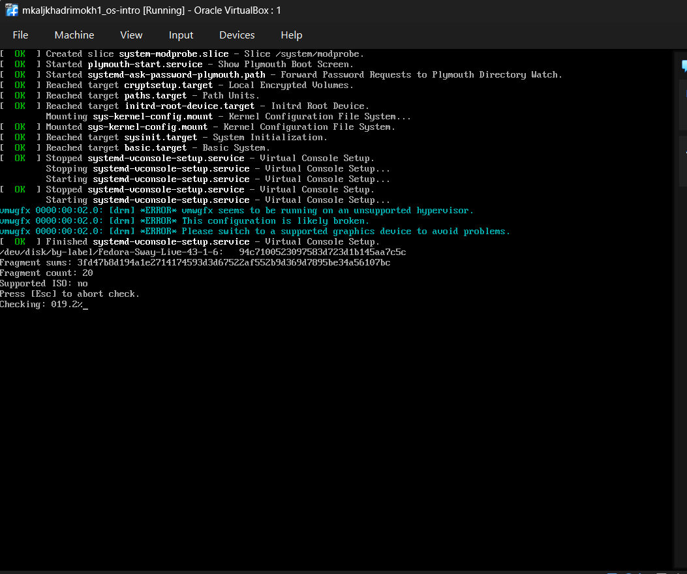

---


## Author

author:
name: Мохаммед Фуад Мохаммед Хамуд Аль-хадри 
degrees: BSc
orcid: N/A
email: [1132255653@rudn.ru](mailto:1132255653@rudn.ru)
affiliation:
- name: Российский университет дружбы народов
country: Российская Федерация
postal-code: N/A
city: Москва
address: ул. Миклухо-Маклая, д.21 k1

## Title

title: "Отчёт по лабораторной работе №1"
subtitle: "Установка операционной системы Linux"
license: "CC BY"
date: today
date-format: "YYYY-MM-DD"
-------------------------

# Информация

## Докладчик

* Студент курса «Введение в операционные системы»
* Российский университет дружбы народов
* Факультет физико-математических и естественных наук

---

# Вводная часть

## Актуальность

* Виртуализация широко используется в современной IT-инфраструктуре
* Позволяет запускать несколько операционных систем на одном компьютере
* Используется для тестирования, обучения и разработки
* Не требует отдельного физического оборудования

---

## Объект и предмет исследования

**Объект исследования**

* виртуальные машины
* операционная система Linux

**Предмет исследования**

* процесс установки Linux
* настройка виртуальной среды

---

## Цели и задачи

**Цель работы**

Приобретение практических навыков установки операционной системы Linux на виртуальную машину.

**Задачи**

* создать виртуальную машину
* установить Fedora Linux
* выполнить настройку системы
* установить инструменты для подготовки документации

---

## Материалы и методы

В работе использовались:

* гипервизор **VirtualBox**
* дистрибутив **Fedora Linux**
* менеджер окон **Sway**
* язык разметки **Markdown**

Программные инструменты:

* **Pandoc**
* **TeX Live**

---

# Выполнение работы

## Создание виртуальной машины

Основные параметры виртуальной машины:

* тип системы: Linux
* версия: Fedora 64-bit
* оперативная память: 2048 MB
* виртуальный диск: 80 GB

[Скриншот: создание виртуальной машины]


---

## Подключение установочного образа

Для установки системы был использован ISO-образ Fedora Sway.

Основные действия:

* подключение ISO-образа
* запуск виртуальной машины
* загрузка Live-системы

[Скриншот: подключение ISO]


---

## Установка Fedora Linux

Установка выполнялась с помощью программы установки.

Основные шаги:

* выбор языка системы
* настройка клавиатуры
* создание пользователя
* установка пароля root
* настройка имени хоста

[Скриншот: процесс установки]


---

## Установка дополнений VirtualBox

Для корректной работы виртуальной машины были установлены дополнения VirtualBox.

Основные команды:

```
dnf group install development-tools
dnf install dkms
/media/VBoxLinuxAdditions.run
```

[Скриншот: установка дополнений]


---

## Обновление системы

После установки системы было выполнено обновление пакетов.

Команда:

```
sudo dnf update
```

Это позволяет установить последние версии программ.

[Скриншот: обновление системы]



---

## Установка дополнительных программ

Для удобства работы были установлены:

* **tmux** — терминальный мультиплексор
* **mc** — файловый менеджер
* **kitty** — терминальный эмулятор

Команда установки:

```
sudo dnf install tmux mc kitty
```

---

## Настройка системы безопасности

В рамках лабораторной работы система SELinux была переведена в режим:

```
permissive
```

Это упрощает дальнейшую работу с системой.

---

## Установка программ для документации

Для подготовки отчётов были установлены:

* **Pandoc** — конвертация Markdown документов
* **TeX Live** — генерация PDF

Команды:

```
sudo dnf install pandoc
sudo dnf install texlive-scheme-full
```

---

# Результаты

## Полученные результаты

В ходе лабораторной работы:

* создана виртуальная машина
* установлена операционная система Fedora
* выполнена базовая настройка системы
* установлены инструменты для подготовки документации

---

# Итог

## Выводы

В ходе выполнения лабораторной работы были получены практические навыки:

* работы с виртуальными машинами
* установки операционной системы Linux
* настройки системы после установки
* использования инструментов подготовки документации

Виртуализация позволяет эффективно создавать изолированные среды для обучения и тестирования программного обеспечения.
