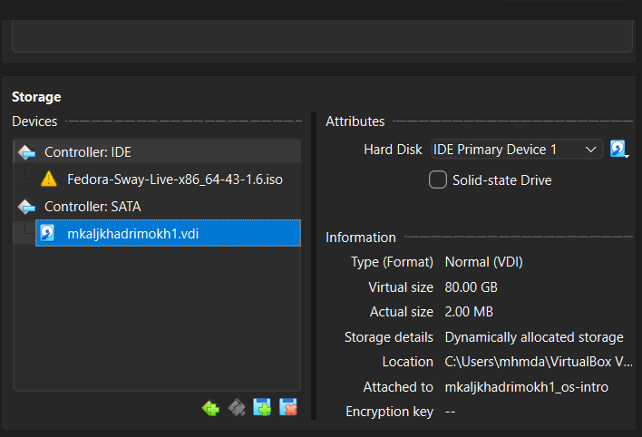
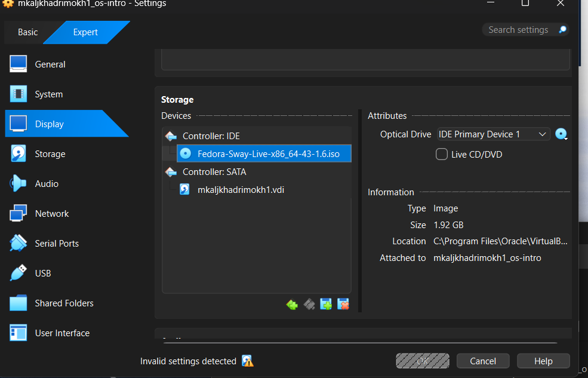
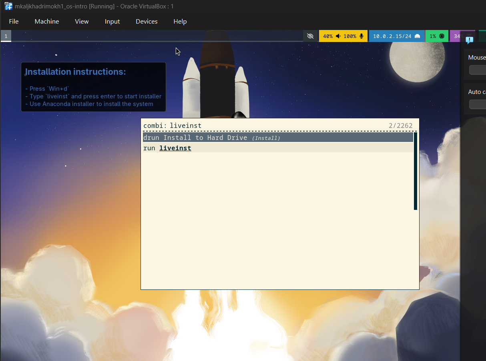

---

## Author

author:
name: Мохаммед Фуад Мохаммед Хамуд Аль-хадри 
degrees: BSc
orcid: N/A
email: [1132255653@rudn.ru](mailto:1132255653@rudn.ru)
affiliation:
- name: Российский университет дружбы народов
country: Российская Федерация
postal-code: N/A
city: Москва
address: ул. Миклухо-Маклая, д.21 k1

## Title

title: "Отчёт по лабораторной работе №1"
subtitle: "Установка операционной системы Linux"
license: "CC BY"
----------------

# Цель работы

Целью данной лабораторной работы является приобретение практических навыков установки операционной системы Linux на виртуальную машину, а также настройка минимально необходимых сервисов и программного обеспечения для дальнейшей работы.

# Задание

В ходе лабораторной работы необходимо:

1. Создать виртуальную машину с использованием VirtualBox.
2. Установить операционную систему Fedora (вариант Fedora Sway).
3. Настроить систему после установки.
4. Установить программное обеспечение для подготовки документации.
5. Проанализировать последовательность загрузки системы.

# Теоретическое введение

Виртуализация — это технология, позволяющая запускать несколько операционных систем на одном физическом компьютере. Для этого используются специальные программы — гипервизоры.

Одним из наиболее распространённых гипервизоров является **VirtualBox**, который позволяет создавать виртуальные машины, устанавливать на них операционные системы и управлять их ресурсами.

В данной лабораторной работе используется дистрибутив **Fedora Linux**. Fedora — это современная операционная система семейства Linux, разрабатываемая сообществом и поддерживаемая компанией Red Hat.

В качестве графической среды используется менеджер окон **Sway**, основанный на протоколе **Wayland**. Sway является тайлинговым оконным менеджером, который автоматически располагает окна без перекрытия.

Для подготовки отчётов используется язык разметки **Markdown**. Он позволяет удобно структурировать текст и легко преобразовывать документы в различные форматы. Для преобразования документов используется инструмент **Pandoc**, а для генерации PDF — система **TeX Live**.

# Выполнение лабораторной работы

## Подготовка каталога для виртуальных машин

Сначала был создан каталог для хранения виртуальных машин.

Команды:

```
cd /var/tmp
mkdir /var/tmp/mkaljkhadrimokh1
```

где `mkaljkhadrimokh1` — имя пользователя в системе.

После создания каталога была проверена папка виртуальных машин по умолчанию.


---

## Настройка VirtualBox

Была проверена директория для хранения виртуальных машин и при необходимости изменена.

Команда:

```
vboxmanage setproperty machinefolder /var/tmp/mkaljkhadrimokh1
```

Проверка настройки:

```
vboxmanage list systemproperties | grep "Default machine folder"
```


---

## Создание виртуальной машины

Виртуальная машина была создана с помощью команды:

```
vboxmanage createvm --name "mkaljkhadrimokh1_os-intro" --ostype Fedora_64 --register
```

Затем была настроена память виртуальной машины:

```
vboxmanage modifyvm "mkaljkhadrimokh1_os-intro" --memory 2048 --acpi on --nic1 nat
```

Также был создан виртуальный жесткий диск.

```
vboxmanage createhd --filename disk.vdi --size 80000
```

[Скриншот: создание виртуальной машины]

{#fig-create-vm width=70%}

---

## Подключение установочного образа

К виртуальной машине был подключён ISO-образ Fedora.

[Скриншот: подключение ISO образа Fedora]

{#fig-iso width=70%}

---

## Установка операционной системы

После запуска виртуальной машины была загружена Live-среда Fedora.

Для запуска установщика была выполнена команда:

```
liveinst
```
{#fig-vbox-additions width=70%}

Во время установки:

* выбран язык системы;
* настроена клавиатура;
* создан пользователь;
* задан пароль root;
* задано имя хоста.


---

## Установка дополнений VirtualBox

После установки системы были установлены дополнения VirtualBox.

Сначала были установлены необходимые пакеты:

```
sudo -i
dnf -y group install development-tools
dnf -y install dkms
```

После этого был подключён диск дополнений и выполнена установка:

```
/media/VBoxLinuxAdditions.run
```

Затем система была перезагружена.

[Скриншот: установка дополнений VirtualBox]

{#fig-vbox-additions width=70%}

---

## Обновление системы

После установки системы были обновлены все пакеты.

Команда:

```
sudo dnf -y update
```


---

## Установка дополнительных программ

Для удобства работы были установлены следующие программы:

```
sudo dnf -y install tmux mc
sudo dnf -y install kitty
```


---

## Настройка автоматического обновления

Для автоматического обновления системы была установлена программа:

```
sudo dnf -y install dnf-automatic
```

Затем был запущен таймер обновлений:

```
sudo systemctl enable --now dnf-automatic.timer
```


---

## Отключение SELinux

Для упрощения работы режим SELinux был изменён.

Файл:

```
/etc/selinux/config
```

Значение:

```
SELINUX=enforcing
```

было заменено на:

```
SELINUX=permissive
```

После изменения система была перезагружена.


---

## Настройка раскладки клавиатуры

Была настроена поддержка двух языков клавиатуры:

```
us,ru
```

Переключение выполняется комбинацией клавиш **Right Ctrl**.


---

## Установка программ для подготовки документации

Для подготовки отчётов были установлены следующие программы.

Установка Pandoc:

```
sudo dnf -y install pandoc
```

Установка TeX Live:

```
sudo dnf -y install texlive-scheme-full
```

Эти программы позволяют создавать документы Markdown и преобразовывать их в формат PDF.


---

## Анализ загрузки системы

Для анализа процесса загрузки системы была использована команда:

```
dmesg | less
```

Из вывода команды были получены следующие данные:

* версия ядра Linux;
* модель процессора;
* частота процессора;
* объём оперативной памяти;
* тип гипервизора;
* тип файловой системы.


# Выводы

В ходе выполнения лабораторной работы была успешно установлена операционная система Fedora Linux на виртуальную машину VirtualBox. Были изучены основные этапы установки системы, её первичной настройки и установки дополнительного программного обеспечения. Также были получены навыки работы с терминалом Linux и инструментами подготовки документации на языке Markdown.

# Список литературы{.unnumbered}

::: {#refs}

1. Dash P. Getting Started with Oracle VM VirtualBox. – Packt Publishing Ltd, 2013.
2. Robbins A. Bash Pocket Reference. – O’Reilly Media, 2016.
3. Немет Э. Unix и Linux: руководство системного администратора. – Вильямс, 2014.
