---

## Author

author:

name: "Аль-хадри Мохаммед Фуад Мохаммед Хамуд"


## Title

title: "Отчёт по лабораторной работе №6"

subtitle: "Основы интерфейса командной строки Unix"

---


# Титульный лист


**Лабораторная работа №6**  

**Аль-хадри Мохаммед Фуад Мохаммед Хамуд** 

**Группа: НКАбд-01-25**

**Дата:03/18/2026** 


---

# Цель работы

Приобретение практических навыков взаимодействия пользователя с системой Unix посредством командной строки.

---

# Выполнение лабораторной работы

## Формат команды

```bash
<имя_команды> <разделитель> <аргументы>
```

## Команда man

```bash
man <команда>
```

### Описание
Команда `man` используется для просмотра справочной информации по командам Linux.

### Пример использования

```bash
man man
```

### Управление просмотром
- `Space` — переход вперёд
- `Enter` — строка вперёд
- `q` — выход

### Скриншот


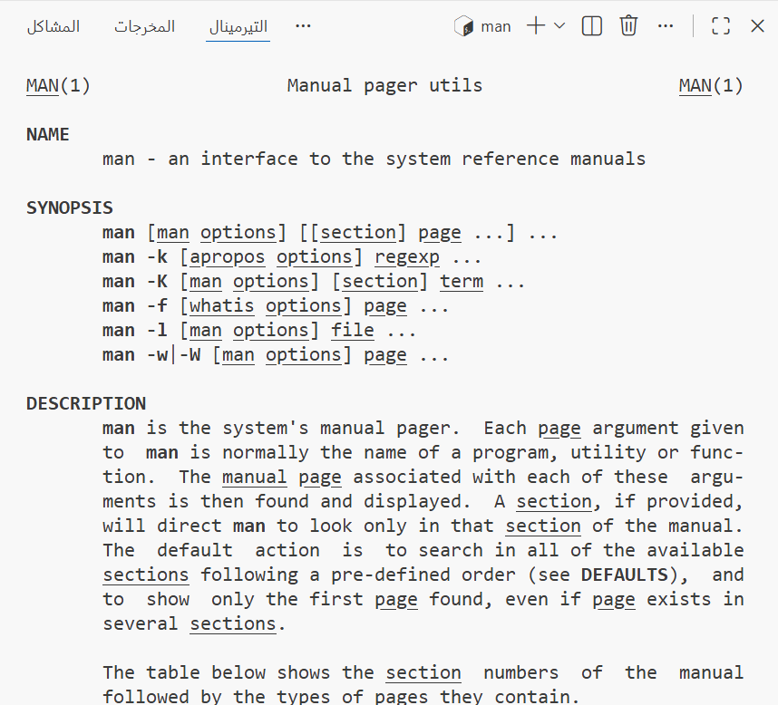

### Вывод
Изучена команда `man`.

---

## Команда cd

```bash
cd [путь_к_каталогу]
```

### Описание
Команда `cd` используется для перемещения по файловой системе.

### Скриншот

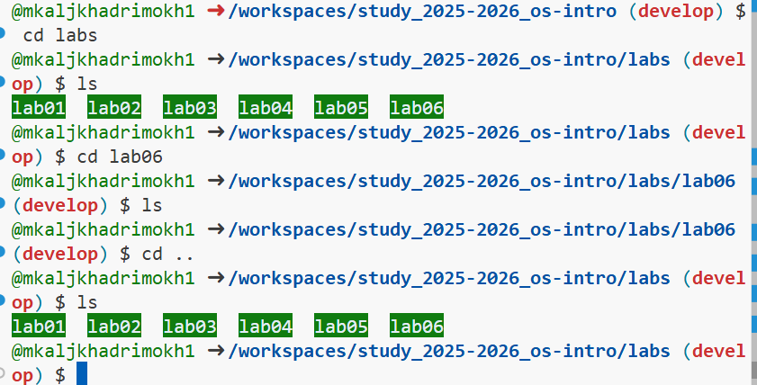

### Особенности
- `cd` — домой
- `cd ~` — домой
- `cd ..` — вверх

### Примеры

```bash
cd lab06
cd ..
cd ~
```

### Скриншот


### Вывод
Освоена навигация по файловой системе.

---

## Команда pwd

```bash
pwd
```

### Описание
Показывает текущую директорию.

### Скриншот

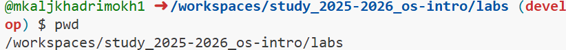

---

## Команда ls

```bash
ls
ls -a
ls -l
ls -alF
```

### Скриншоты


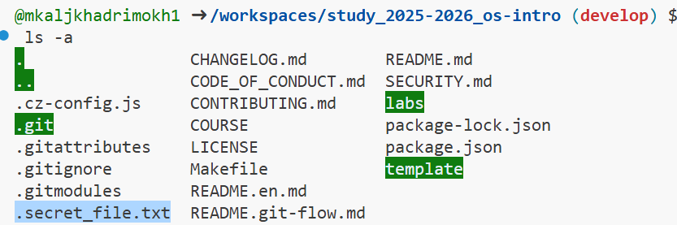
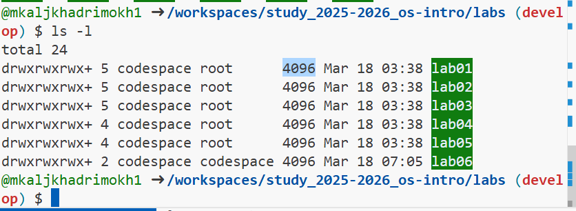

---

## Команда mkdir

```bash
mkdir abc
mkdir abc/dir
mkdir dir1 dir2 dir3
mkdir abc/{tmp1,tmp2,tmp3}
mkdir -p ~/dir1/dir2/dir3
```

### Скриншоты

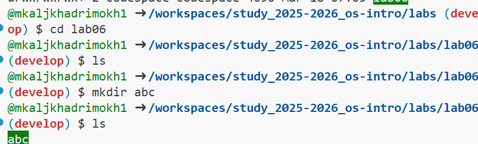
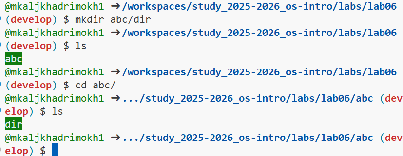
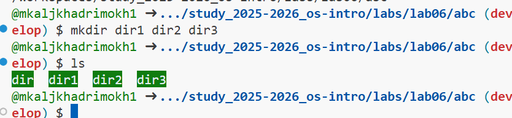

---

## Команда rm

```bash
rm -i file.txt
rm -r abc
rmdir emptydir
```

### Скриншоты

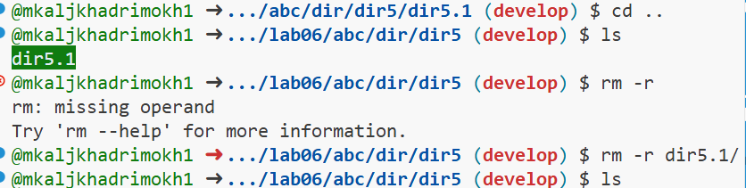
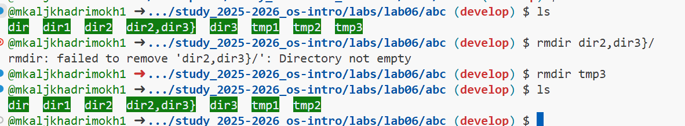

---

## Команда history

```bash
history
!91
!89:s/-r/-i
```

### Скриншот

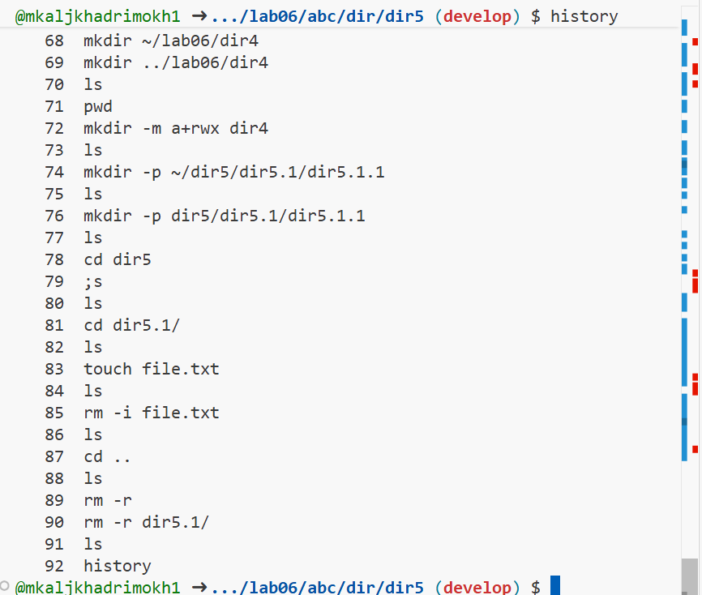

---

## Использование `;`

```bash
mkdir test; touch file
```

### Скриншот

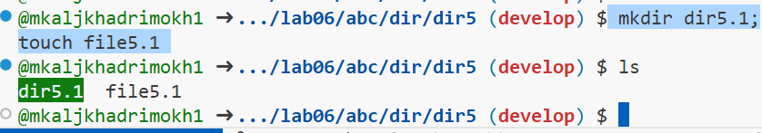

---

# Общие выводы

Изучены основные команды Unix и работа с файловой системой.

---

# Заключение

Работа позволила освоить базовые команды Linux и навигацию в системе.
