---
## Title
title: "Лабораторная работа №7"
subtitle: "Архитектура компьютера"
license: "Аль-хадри Мохаммед Фуад Мохаммед Хамуд"
---

## Докладчик

  * Аль-хадри Мохаммед Фуад Мохаммед Хамуд
  * НКАбд-01-25 
  * Российский университет дружбы народов им. П. Лумумбы
  * 1132255653

# Цель работы

Ознакомление с файловой системой Linux, её структурой и основными принципами работы. Получение практических навыков по использованию основных команд Linux для работы с файлами и каталогами, изменению прав доступа, а также анализу состояния файловой системы.

---

# Теоретическое введение

Файловая система Linux представляет собой иерархическую структуру каталогов и файлов. Каждый файл или каталог имеет своё имя, расположение и набор прав доступа.

---

# Основные команды

touch  
cat  
less  
head  
tail  
cp  
mv  
mkdir  
chmod  
df  
fsck  
mount  
kill  

---

# Шаг 1

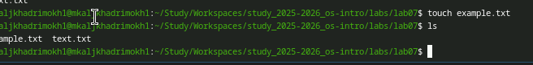

---

# Шаг 2

---

# Шаг 3

---

# Шаг 4

---

# Шаг 5

---

# Шаг 6

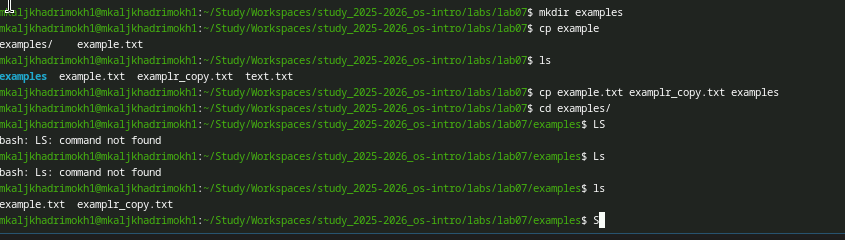

---

# Шаг 7

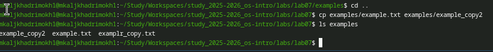

---

# Шаг 8

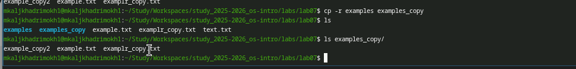

---

# Шаг 9

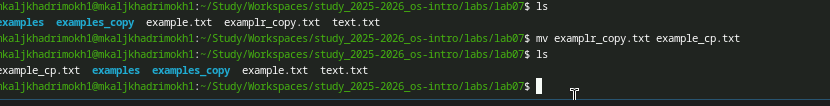

---

# Шаг 10

---

# Шаг 11

---

# Шаг 12

---

# Шаг 13

---

# Шаг 14

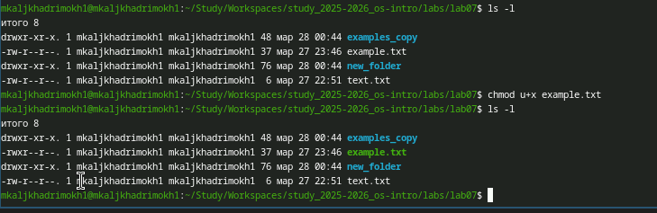

---

# Шаг 15

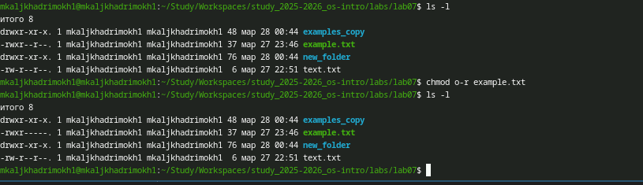

---

# Шаг 16

---

# Шаг 17

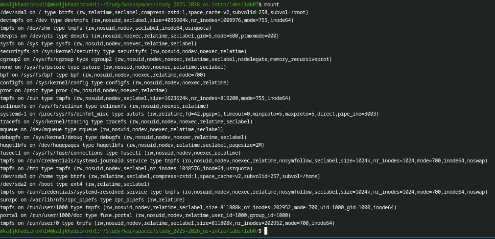

---

# Шаг 18

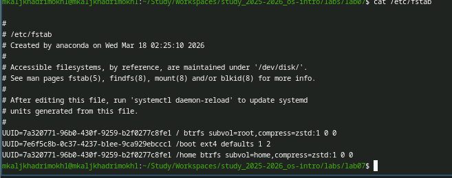

---

# Шаг 19

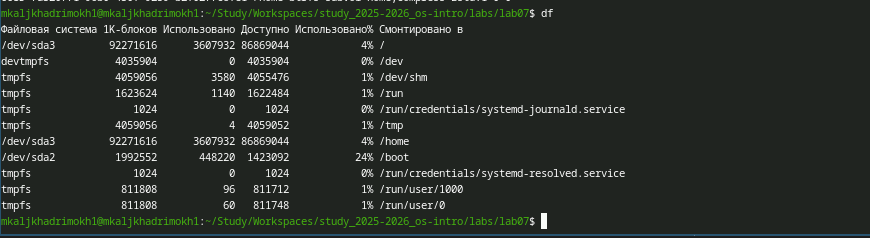

---

# Шаг 20

---

# Шаг 21

---

# Шаг 22

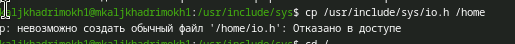

---

# Шаг 23

---

# Шаг 24

---

# Шаг 25

---

# Шаг 26

---

# Шаг 27

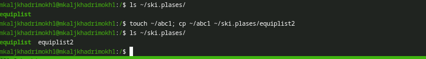

---

# Шаг 28

---

# Шаг 29

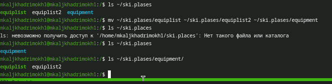

---

# Шаг 30

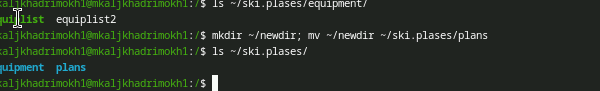

---

# Шаг 31

---

# Шаг 32

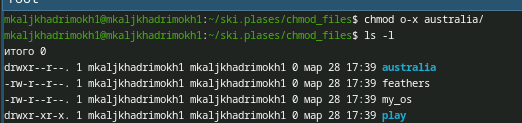

---

# Шаг 33

---

# Шаг 34

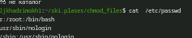

---

# Шаг 35

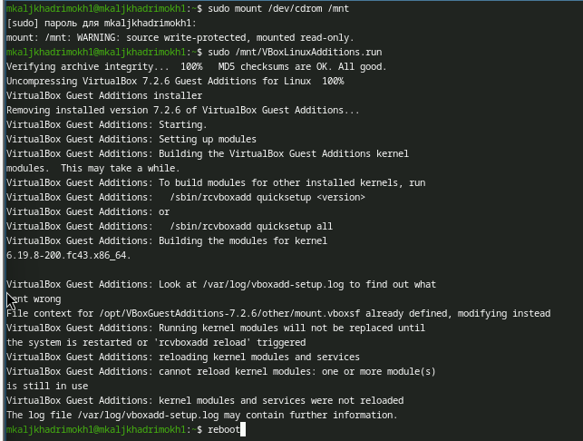

---

# Выводы

В ходе выполнения лабораторной работы была изучена файловая система Linux и её структура. Были освоены основные команды для работы с файлами и каталогами.