---
title: "Лабораторная работа №7"
subtitle: "дисциплина: Архитектура компьютера"
author: "Аль-хадри Мохаммед Фуад Мохаммед Хамуд"
# Цель работы

Ознакомление с файловой системой Linux, её структурой и основными принципами работы. Получение практических навыков по использованию основных команд Linux для работы с файлами и каталогами, изменению прав доступа, а также анализу состояния файловой системы.

# Теоретическое введение

Файловая система Linux представляет собой иерархическую структуру каталогов и файлов. Каждый файл или каталог имеет своё имя, расположение и набор прав доступа. Пользователь может выполнять различные операции с файлами и каталогами, такие как создание, копирование, перемещение, переименование и удаление.

Для выполнения этих операций используются специальные команды командной строки. К наиболее часто используемым командам относятся команды для создания файлов и каталогов, просмотра содержимого файлов, копирования и перемещения данных, а также изменения прав доступа.

Также важной частью работы с системой является анализ состояния файловой системы. Для этого используются команды, позволяющие определить объём свободного пространства, проверить целостность файловой системы и просмотреть подключённые устройства хранения данных.

# Основные команды

Основные команды, использованные в ходе лабораторной работы:

- **touch** — используется для создания нового файла.
- **cat** — выводит содержимое текстового файла в терминал.
- **less** — позволяет просматривать большие файлы постранично.
- **head** — выводит первые строки файла.
- **tail** — выводит последние строки файла.
- **cp** — используется для копирования файлов и каталогов.
- **mv** — применяется для перемещения и переименования файлов и каталогов.
- **mkdir** — создаёт новый каталог.
- **chmod** — изменяет права доступа к файлам и каталогам.
- **df** — показывает информацию о свободном месте на диске.
- **fsck** — проверяет целостность файловой системы.
- **mount** — подключает файловую систему.
- **kill** — завершает процессы в системе.

# Выполнение лабораторной работы

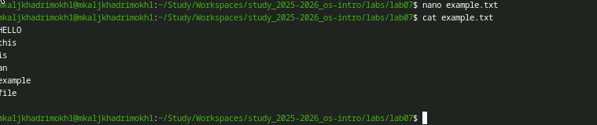

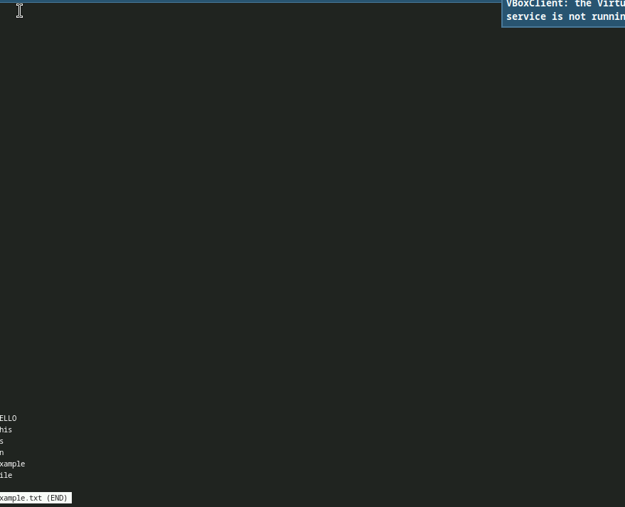

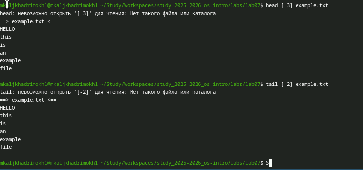

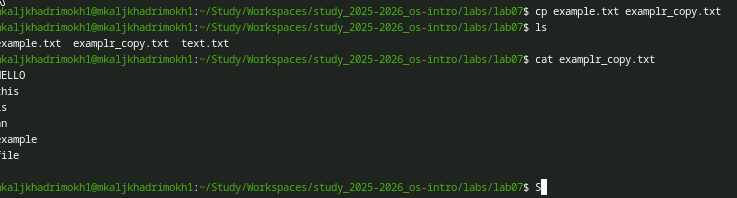

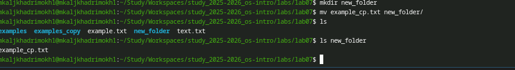

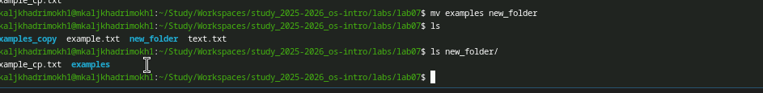

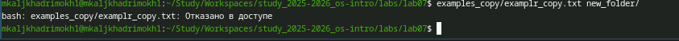

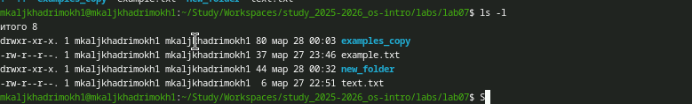

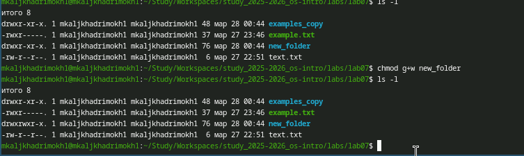

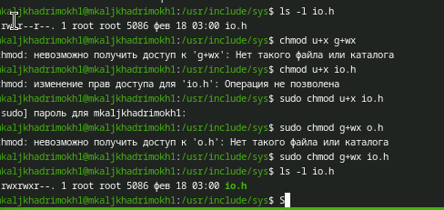

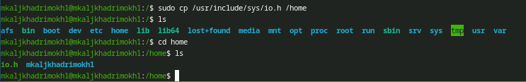

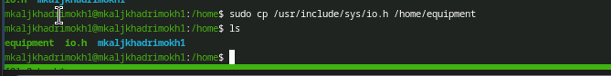

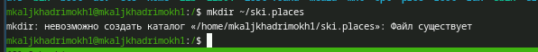

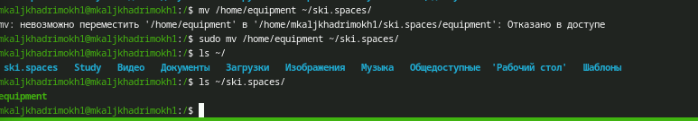

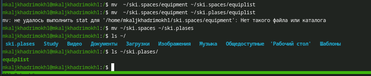

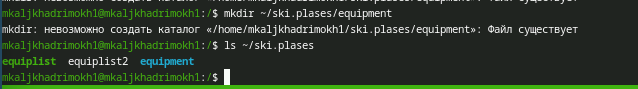

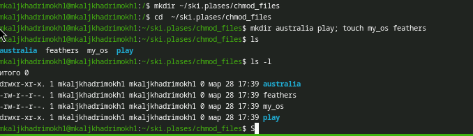

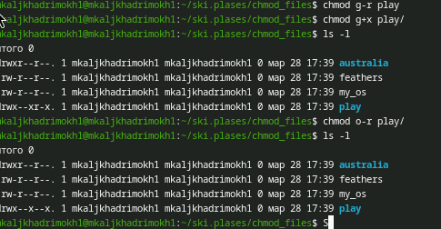

# Выводы

В ходе выполнения лабораторной работы была изучена файловая система Linux и её структура. Были освоены основные команды для работы с файлами и каталогами, а также методы изменения прав доступа. Кроме того, были рассмотрены команды для анализа состояния файловой системы и управления процессами.