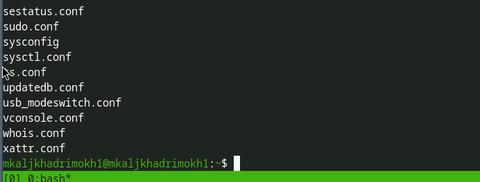
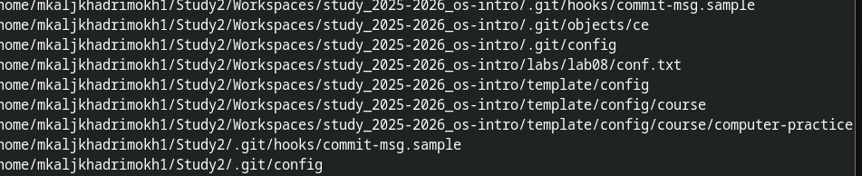
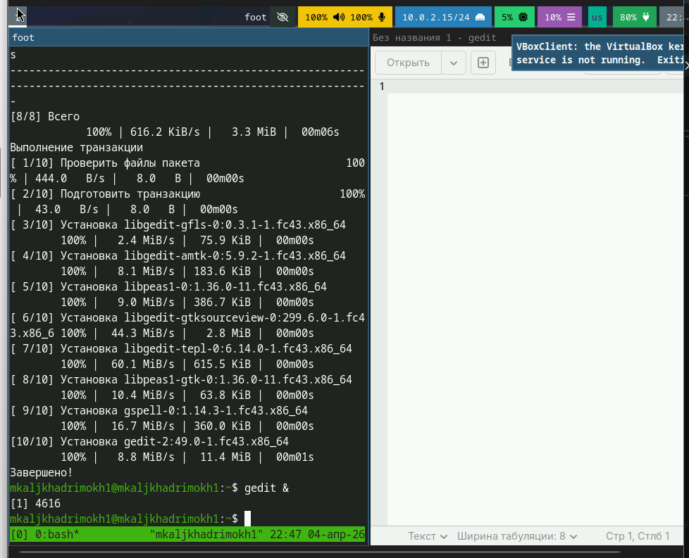
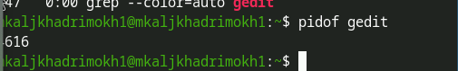
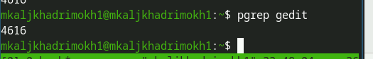
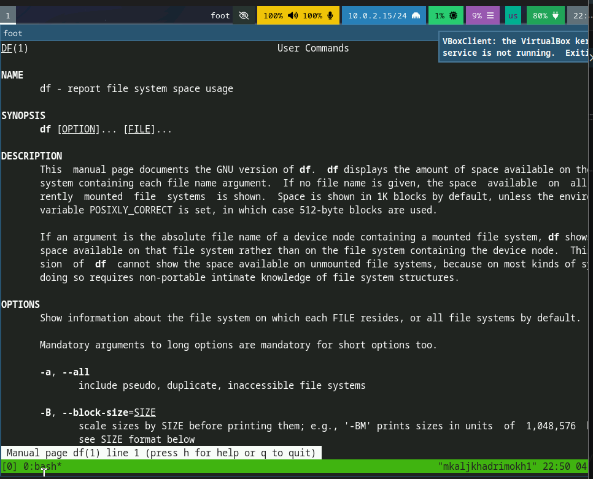
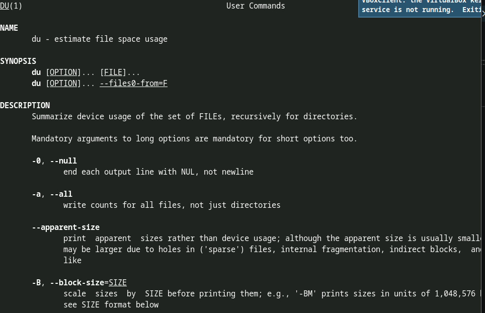
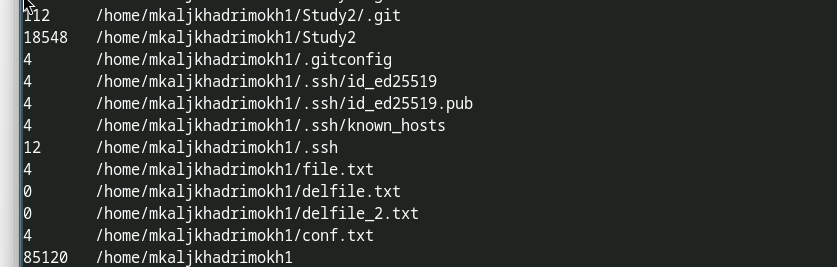

---
## Author
author:
  name: Аль-хадри Мохаммед Фуад Мохаммед Хамуд
  email: 1132255653@rudn.ru
  affiliation:
    - name: Российский университет дружбы народов
      country: Российская Федерация
      city: Москва
      address: ул. Миклухо-Маклая
## Title
title: Поиск файлов и фильтрация данных
subtitle: Презентация по лабораторной работе №8
license: CC BY
date: today
date-format: "YYYY-MM-DD"
---

# Информация

## Докладчик

:::::::::::::: {.columns align=center}
::: {.column width="70%"}

  * Аль-хадри Мохаммед Фуад Мохаммед Хамуд
  * студент, НКАбд-01-25, 1132255653
  * факультет физико-математических и естественных наук
  * Российский университет дружбы народов им. П. Лумумбы

:::
::: {.column width="30%"}

:::
::::::::::::::
# Цель работы

Ознакомление с инструментами поиска файлов и фильтрации текстовых данных.  
Приобретение практических навыков управления процессами (и заданиями),  
проверки использования дискового пространства и обслуживания файловых систем.

---

# Задание

Выполнить действия по:
- перенаправлению ввода и вывода
- поиску файлов
- фильтрации текстовых данных
- управлению процессами
- проверке использования дискового пространства

---

# 1. Вход в систему

На первом этапе была выполнена авторизация в операционной системе с использованием имени пользователя.

---

# 2. Запись файлов из `/etc` в file.txt

Сначала был получен список файлов из каталога `/etc` и записан в файл `file.txt`.

---

# 2. Добавление файлов из домашнего каталога

После этого список файлов из домашнего каталога был добавлен в тот же файл.

---

# 3. Поиск файлов `.conf`

Из файла `file.txt` были выбраны имена файлов с расширением `.conf`.

---

# Просмотр найденных файлов

---

# 4. Файлы начинающиеся с `c` (метод 1)

---

# Файлы начинающиеся с `c` (метод 2)

---

# Файлы начинающиеся с `c` (метод 3)

---

# 5. Файлы из `/etc` начинающиеся с `h`

---

# Альтернативный способ поиска `h`

---

# 6. Запуск фонового процесса

Процесс записывает файлы начинающиеся с `log` в `~/logfile`.

---

# 7. Удаление файла logfile

---

# 8. Установка и запуск gedit

---

# 9. Определение PID процесса gedit

---

# 10. Завершение процесса gedit

---

# 11. Команда df

---

# Команда du

---

# 12. Поиск директорий в домашнем каталоге

---

# Выводы

В ходе выполнения лабораторной работы были изучены инструменты поиска файлов и фильтрации текстовых данных.  
Получены практические навыки управления процессами, проверки использования дискового пространства и работы с файловой системой.