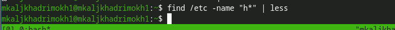
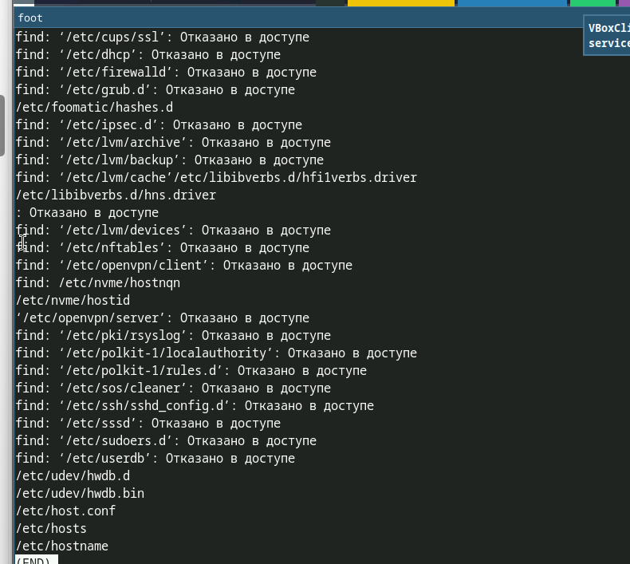
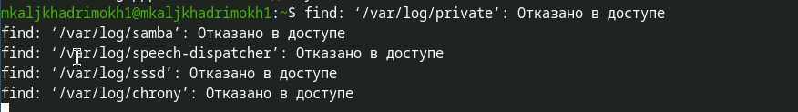
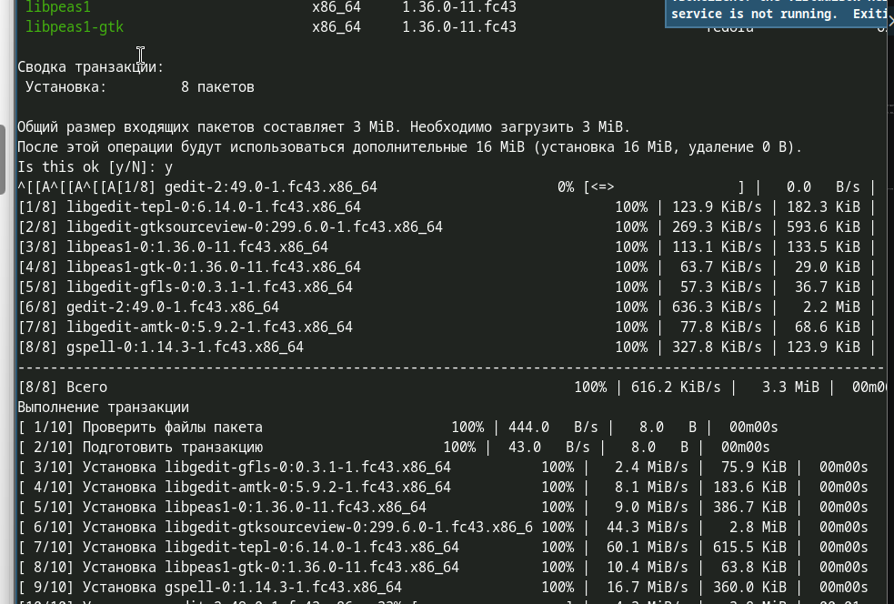
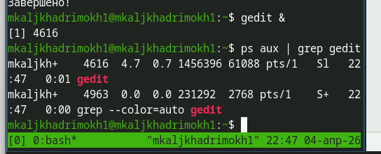
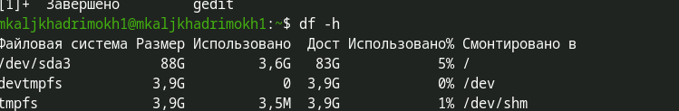
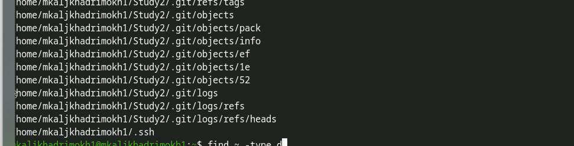

---
## Author
author:
  name: Аль-хадри Мохаммед Фуад Мохаммед Хамуд
  email: 1132255653@rudn.ru
  affiliation:
    - name: Российский университет дружбы народов
      country: Российская Федерация
      city: Москва
      address: ул. Миклухо-Маклая

## Title
title: "Отчёт по лабораторной работе №8"
subtitle: "Архитектура компьютера и операционные системы"
---

# Цель работы

Ознакомление с инструментами поиска файлов и фильтрации текстовых данных. Преобретение практических навыков: по управлению процессами (и заданиями), по проверке использования диска и обслуживания текстовых систем.

# Задание

Выполнить действия по перенаправлению ввода-вывода, поиску файлов, фильтрации текста, управлению процессами и проверке использования диска.
 
# Выполнение лабораторной работы
### 1. Вход в систему

На первом этапе была выполнена авторизация в операционной системе с использованием имени пользователя. После успешного входа была открыта консоль для выполнения последующих команд.

---

### 2. Запись имён файлов из каталога `/etc` и домашнего каталога

Сначала был получен список файлов, содержащихся в каталоге `/etc`, и записан в текстовый файл `file.txt`.  
После этого список файлов из домашнего каталога был добавлен в тот же файл.

{#etc-files-list}

{#home-files-append}

---

### 3. Поиск файлов с расширением `.conf`

Из файла `file.txt` были выбраны все имена файлов, имеющие расширение `.conf`.  
Для фильтрации текста была использована команда `grep`.  
Результат был записан в новый файл `conf.txt`.

{#conf-files-filter}
{#show-conf}
{#show-conf2}
---

### 4. Определение файлов, начинающихся с символа **c**

В домашнем каталоге были найдены файлы, имена которых начинаются с символа **c**.  
Для выполнения задания можно использовать несколько способов, например команды `ls`, `grep` или `find`.

{#files-start-c-first-method}
{#files-start-c-second-method}
{#files-start-c-second-method}
{#files-start-c-third-method}

---

### 5. Просмотр файлов из каталога `/etc`, начинающихся с **h**

Для просмотра файлов, имена которых начинаются с символа **h**, была выполнена команда, выводящая результат постранично.

{#files-start-h}
{#files-start-h}
{#files-start-h-second-method}
{#files-start-h-second-method}

---

### 6. Запуск фонового процесса

Был запущен процесс в фоновом режиме, который записывает в файл `~/logfile` имена файлов, начинающихся с `log`.

{#background-log-process}

---

### 7. Удаление файла logfile

После выполнения предыдущего шага файл `logfile` был удалён из домашнего каталога.

{#delete-logfile}

---

### 8. Запуск редактора gedit в фоновом режиме

Текстовый редактор **gedit** был запущен из консоли в фоновом режиме, что позволило продолжать работу в терминале.

{#gedit-install}
{#gedit-background}

---

### 9. Определение идентификатора процесса gedit

Для определения идентификатора процесса (PID) редактора **gedit** была использована команда `ps` вместе с фильтром `grep`.

{#gedit}
{#gedit}
{#gedit}

---

### 10. Завершение процесса gedit

После изучения справки команды `kill` процесс редактора **gedit** был завершён по его PID.

{#kill-gedit-process}

---

### 11. Использование команд df и du

С помощью команды `df` была получена информация об использовании дискового пространства.  
Команда `du` была использована для определения объёма пространства, занимаемого файлами и каталогами.

{#man-df}
{#man-df}

{#df-result}

{#man-du}
{#man-du}

{#du-result}
{#du-result}

---

### 12. Поиск всех директорий в домашнем каталоге

С помощью команды `find` были выведены имена всех директорий, находящихся в домашнем каталоге пользователя.

{#find-home-directories}
{#find-home-directories}

 
# Выводы
 
В ходе работы освоены инструменты поиска файлов и фильтрации текстовых данных, приобретены навыки управления процессами, проверки использования диска и обслуживания файловых систем.
 
# Контрольные вопросы
 
1. В системе есть три стандартных потока: stdin (0) — стандартный ввод, stdout (1) — стандартный вывод, stderr (2) — стандартный вывод ошибок.
 
2. Оператор > перезаписывает файл, а >> добавляет в конец файла.
 
3. Конвейер (pipe) — механизм передачи вывода одной команды на ввод другой команды, обозначается символом |.
 
4. Процесс — это программа в стадии выполнения. Программа — это статический набор инструкций, процесс — динамический объект с состоянием.
 
5. PID (Process ID) — уникальный идентификатор процесса. GID (Group ID) — идентификатор группы процессов.
 
6. Задачи (jobs) — фоновые процессы. Управлять ими можно командой jobs, а также fg, bg, kill.
 
7. top — интерактивная программа для мониторинга процессов. htop — улучшенная версия top с более удобным интерфейсом.

8. Команда find используется для поиска файлов. Примеры: find ~ -name "*.txt" -print, find /etc -type f -name "*.conf".
 
9. Да, для поиска по содержимому используется grep. Пример: grep "текст" *.txt.
 
10. Объем свободной памяти на диске можно определить командой df -h.
 
11. Объем домашнего каталога можно определить командой du -sh ~.
 
12. Зависший процесс удаляется командой kill с PID процесса. Если процесс не завершается, используется kill -9 PID.

