---
## Author
author:
  name: Аль-хадри Мохаммед Фуад Мохаммед Хамуд
  email: 1132255653@rudn.ru
  affiliation:
    - name: Российский университет дружбы народов
      country: Российская Федерация
      city: Москва
      address: ул. Миклухо-Маклая
## Title
title: Поиск файлов и фильтрация данных
subtitle: Презентация по лабораторной работе №10
license: CC BY
date: today
date-format: "YYYY-MM-DD"
---

# Информация

## Докладчик

:::::::::::::: {.columns align=center}
::: {.column width="70%"}

  * Аль-хадри Мохаммед Фуад Мохаммед Хамуд
  * студент, НКАбд-01-25, 1132255653
  * факультет физико-математических и естественных наук
  * Российский университет дружбы народов им. П. Лумумбы

:::
::: {.column width="30%"}

:::
::::::::::::::

# Цель работы

Познакомиться с операционной системой Linux.Получитьпрактические навыки рабо
тысредактором vi,установленным по умолчанию практически во всехдистрибутивах

---

# Задание
- Создание нового файла с использованием vi
- Редактирование существующего файла

---

# Теоретическое введение

В большинстве дистрибутивов Linux в качестве текстового редактора по умолчанию
устанавливается интерактивный экранный редактор vi (Visual display editor).
Редактор vi имеет три режима работы:

– командный  режим— предназначен для ввода команд редактирования и навигации по
редактируемому файлу;

– режим вставки—предназначен для ввода содержания редактируемого файла;

– режим последней(или командной) строки—используетсядля записи изменений в файл
ивыхода изредактора.

---

# Выполнение лабораторной работы

---

## Задание 1.Создание нового файла с использованием vi

 1.1. Создание каталога с именем workspaces/study_2025-2026_os-intro/labs/lab10

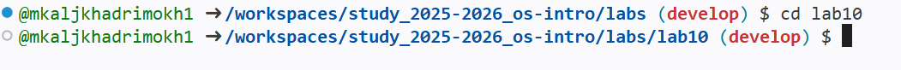

---

 1.2  Переход во вновь созданный каталог.

---

 1.3 Вызов vi и создание файл hello.sh

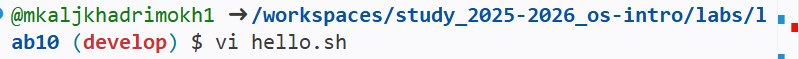

---

 1.4 нажим клавиша i и ввод текста

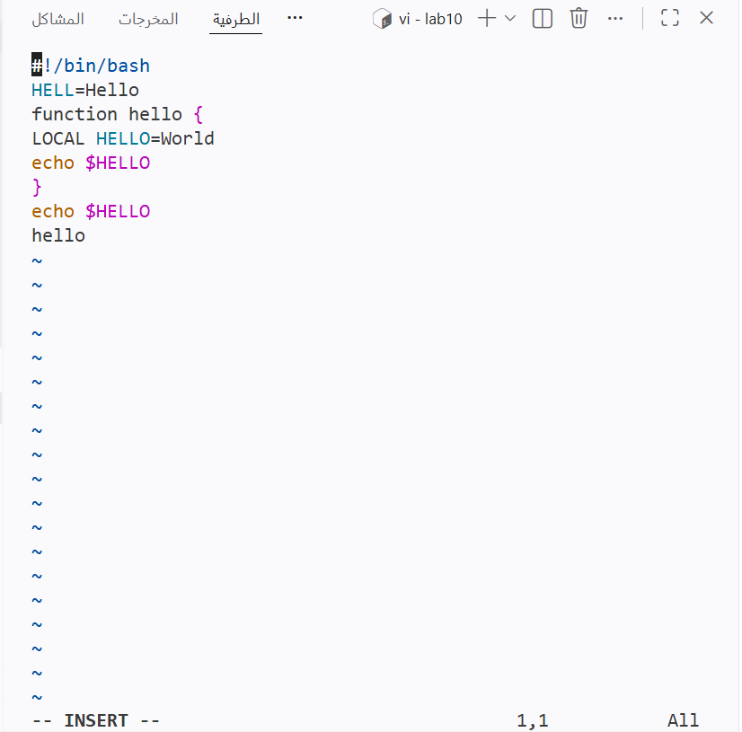

---

 1.5  Нажим клавиша Esc для перехода в командный режим после завершения ввода текста.

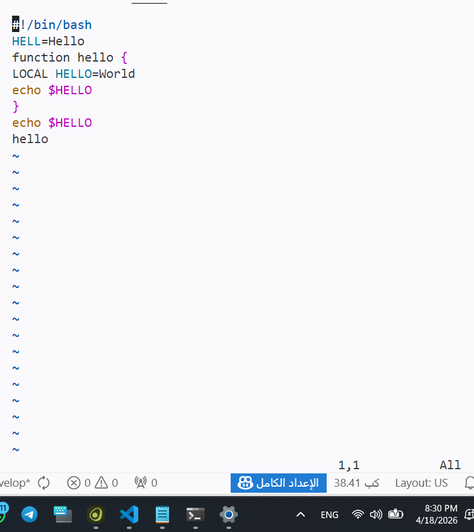

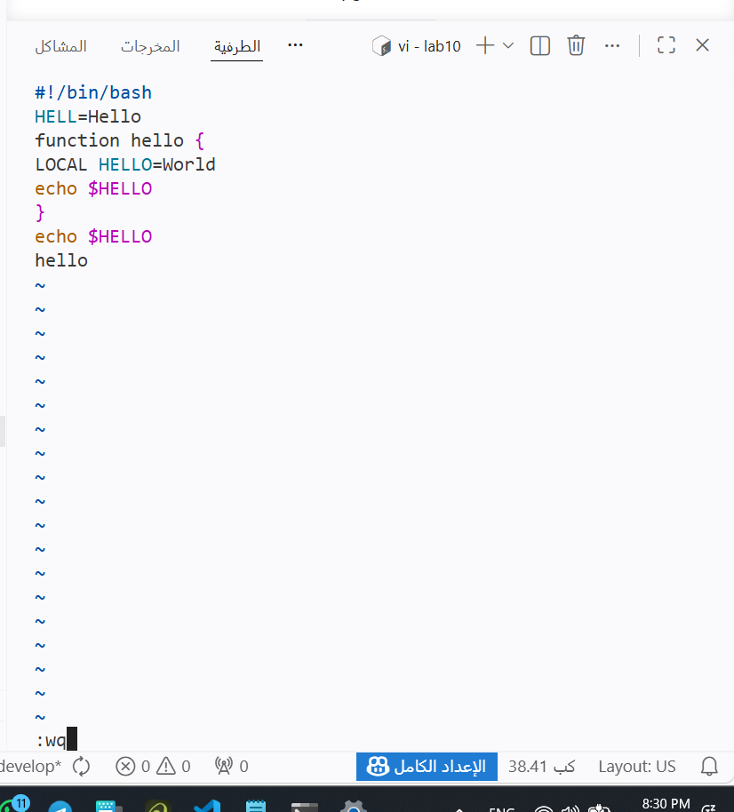

---

 1.6 Нажим : для перехода в режим последней строки и внизу вашего экрана появится приглашение в виде двоеточия

---

 1.7 Нажим w (запис) и q (выйти),а затем нажим клавиша Enter для сохранения текста и завершения работы.

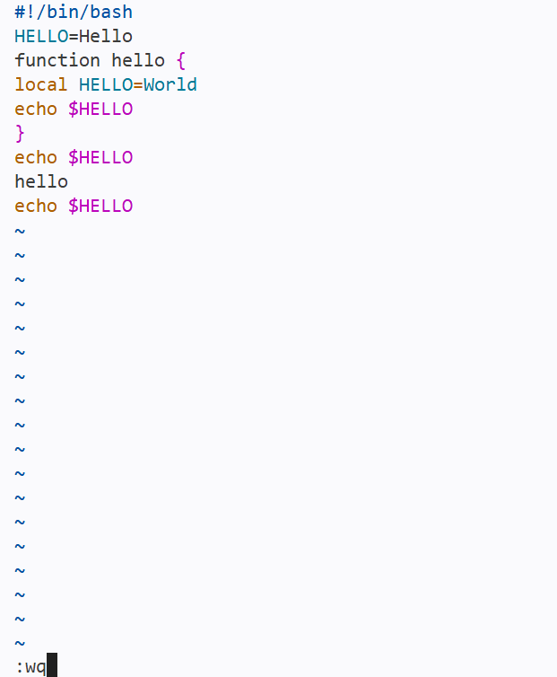

---

 1.8 сделка файла исполняемым "chmod +x hello.sh"

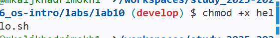

---

## Задание 2.Редактирование существующего файла

 2.1 Вызов vi на редактирование файла "vi ~workspaces/study_2025-2026_os-intro/labs/lab10/hello.sh"

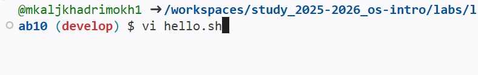

---

 2.2 установление курсора в конец слова HELL второй строки.

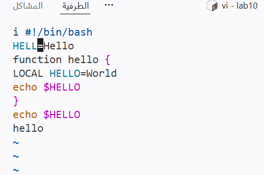

---

 2.3 Переход в режим вставки и изамениние на HELLO. Нажим Esc для возврата в команд ныйрежим.

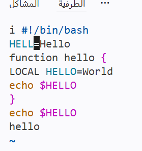

---

 2.4 установление курсора на четвертую строку и сотрите слово LOCAL.

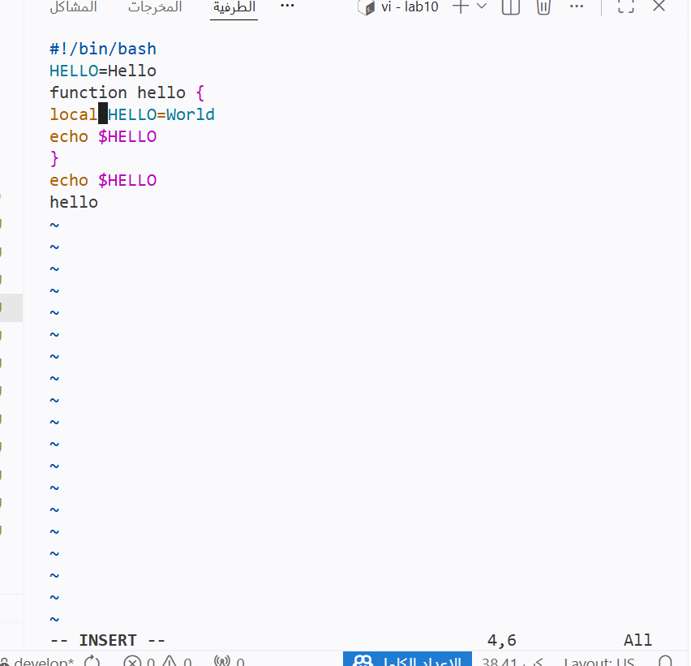

---

 2.5 переход в режим вставки и набор текст: local,нажим возврата в командный режим.

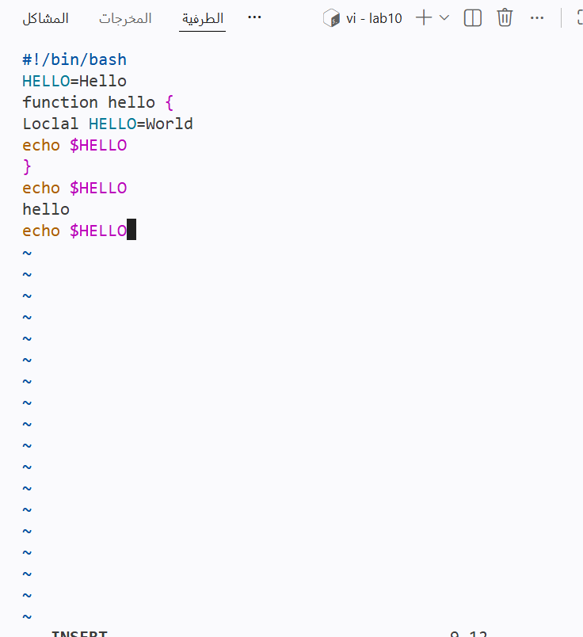

---

 2.6 установление курсора на последней строке файла.Встав после неё строку,содержащую  текст: echo $HELLO.

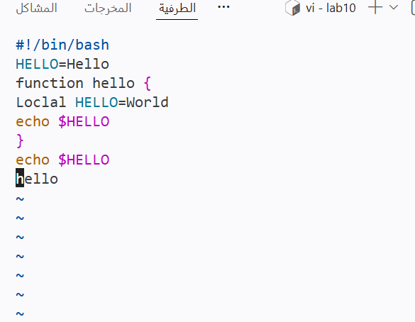

---

 2.7 нажим Esc для перехода в командный режим

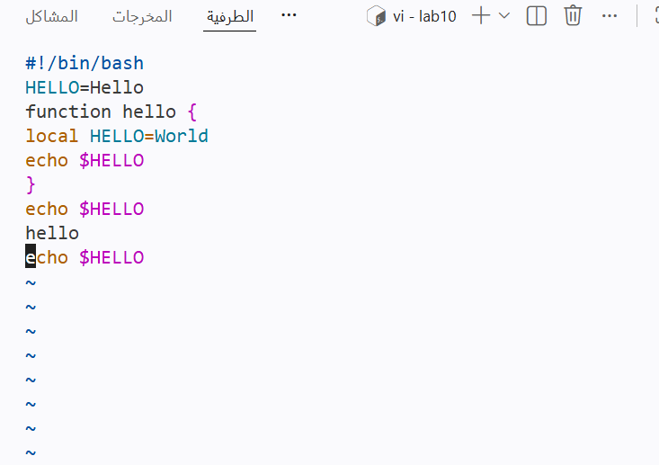

---

 2.8 Удаление последнюю строку.

---

 2.9 Введите команду отмены изменений u для отмены последней команды

---

 2.10 Введитесимвол : для перехода в режим последней строки.Запис произведённые изменения и выйдите из vi.

---

# Выводы

В ходе работы освоены Получиние практические навыки работы с редактором vi.

---

# Список литературы{.unnumbered}

::: {#refs}
:::

---

# Контрольные вопросы

---

