---
## Author
author:
  name: Аль-хадри Мохаммед Фуад Мохаммед Хамуд
  email: 1132255653@rudn.ru
  affiliation:
    - name: Российский университет дружбы народов
      country: Российская Федерация
      city: Москва
      address: ул. Миклухо-Маклая, 21

# Title
title: "Лабораторная работа №11, Работа с текстовым редактором Emacs"
subtitle: "Архитектура компьютера и операционные системы"
license: "CC BY"
---

# Цель работы
Познакомиться с текстовым редактором Emacs. Получить практические навыки работы с Emacs в операционной системе Linux, включая создание, редактирование, сохранение файлов, а также управление буферами и окнами.

---

# Задание
- Запустить редактор Emacs  
- Создать файл lab07.sh  
- Ввести заданный текст  
- Сохранить файл  
- Выполнить операции редактирования (вырезание, копирование, вставка, отмена)  
- Освоить команды перемещения курсора  
- Изучить работу с буферами  
- Освоить управление окнами  
- Выполнить поиск и замену текста  

---

# Теоретическое введение
Emacs — это мощный многофункциональный текстовый редактор, используемый в системах Linux и Unix. Он отличается высокой расширяемостью и использованием комбинаций клавиш для выполнения команд.

Основные возможности Emacs:
- редактирование текстовых файлов  
- работа с несколькими буферами  
- разделение окна на несколько областей  
- выполнение поиска и замены текста  
- поддержка различных режимов  

В отличие от редактора vi, Emacs не использует режимы работы, а все команды выполняются через сочетания клавиш (Ctrl, Alt).

---

# Выполнение лабораторной работы

## Задание 1. Работа в редакторе Emacs

### 0.установление Emacs
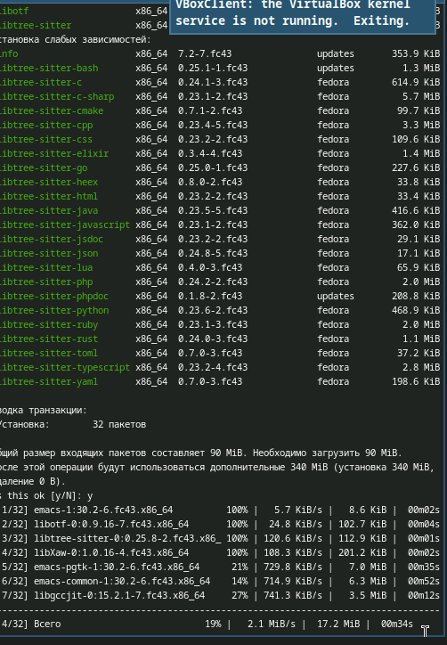

### 1. Запуск Emacs

1.1 Открыть редактор Emacs  

emacs

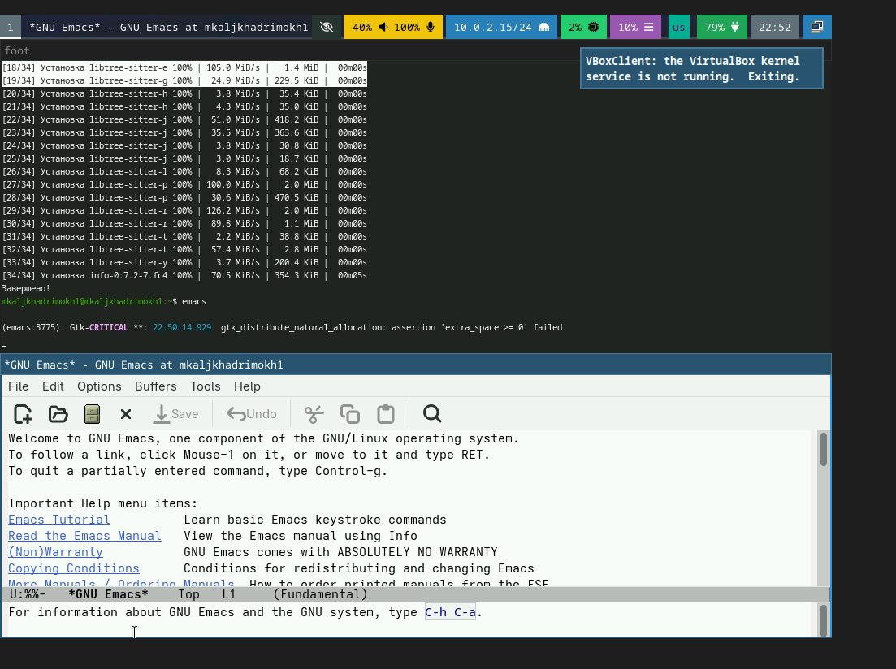

---

### 2. Создание файла

2.1 Создать файл `lab07.sh` с помощью комбинации  
Ctrl + x, Ctrl + f  
Ввести имя файла: lab07.sh  

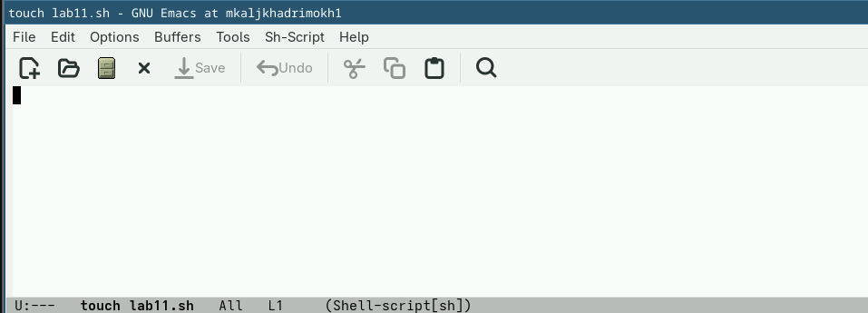

---

### 3. Ввод текста

3.1 Набрать следующий текст:

#!/bin/bash
HELL=Hello
function hello {
LOCAL HELLO=World
echo $HELLO
}

---

### 4. Сохранение файла

4.1 Сохранить файл  
Ctrl + x, Ctrl + s  

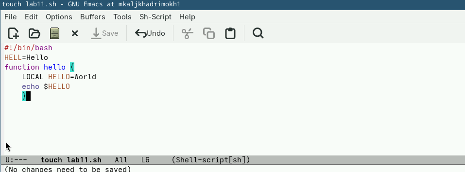

---

## Задание 2. Редактирование текста

### 5. Основные операции

5.1 Вырезать строку (C-k)  

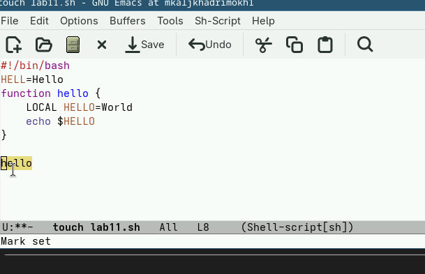
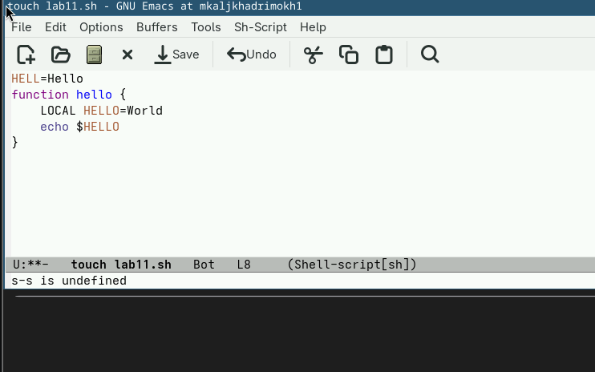
---

5.2 Вставить строку (C-y)  

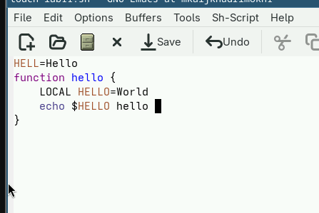

---

5.3 Выделить область (C-space)  

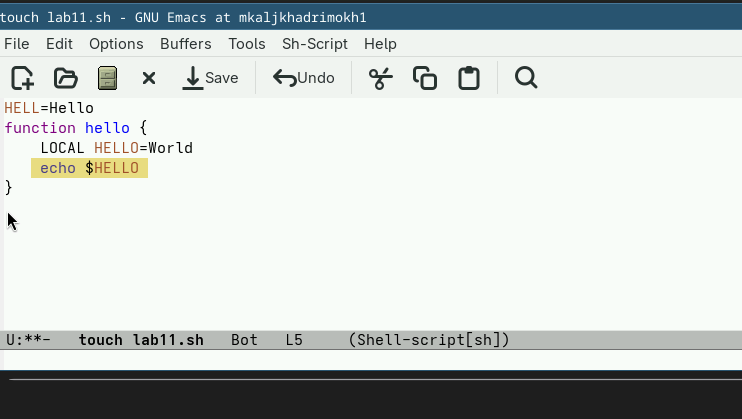

---

5.4 Скопировать область (M-w)  

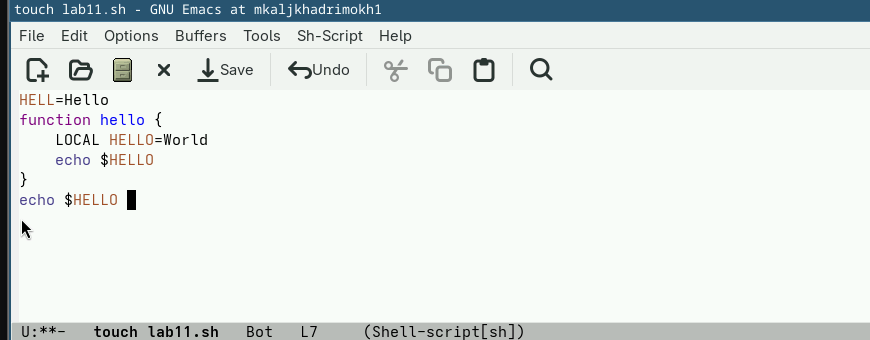

---

5.5 Вставить область  

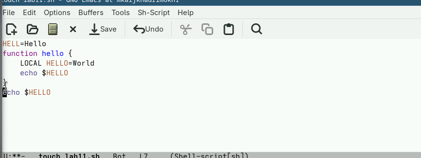

---

5.6 Вырезать область (C-w)  

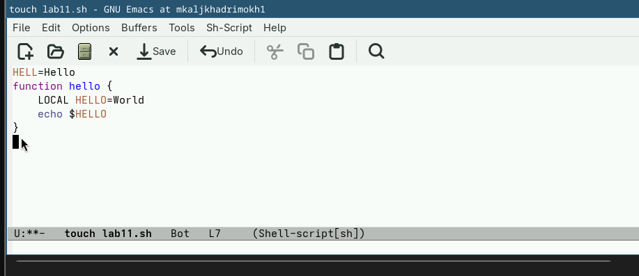

---

5.7 Отмена действия (C-/)  

---

## Задание 3. Перемещение курсора

6.1 В начало строки (C-a)  

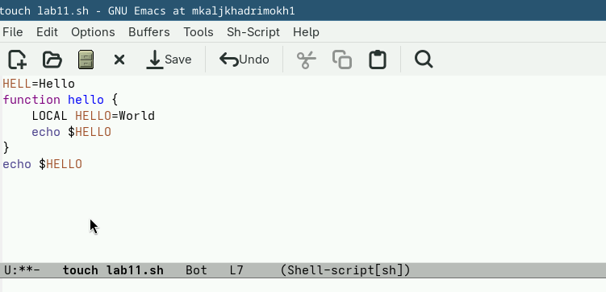
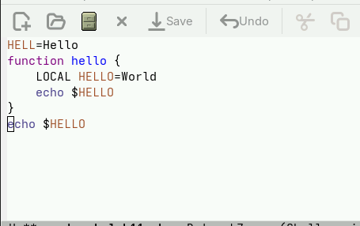
---

6.2 В конец строки (C-e)  

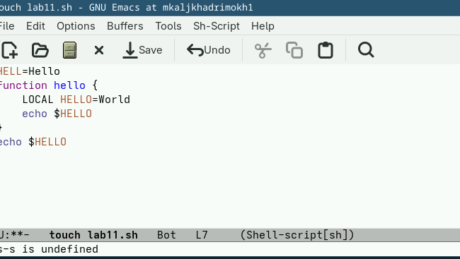

---

6.3 В начало буфера (M-<)  

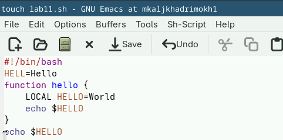

---

6.4 В конец буфера (M->)  

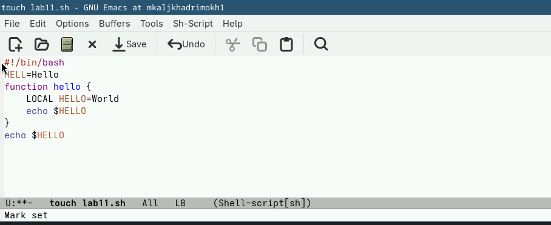

---

## Задание 4. Управление буферами

7.1 Список буферов (C-x C-b)  

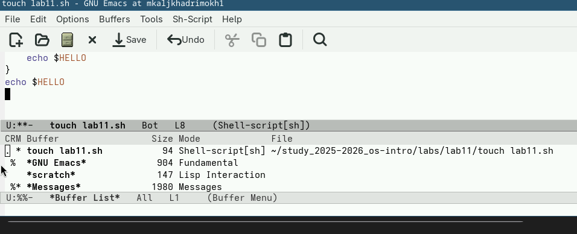

---

7.2 Переключение окна (C-x o)  

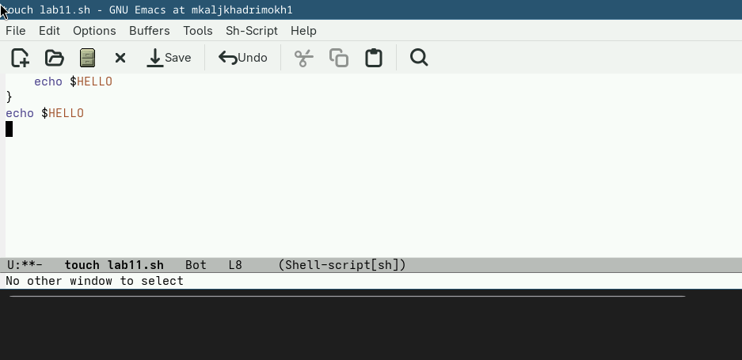

---

7.3 Закрытие окна (C-x 0)  

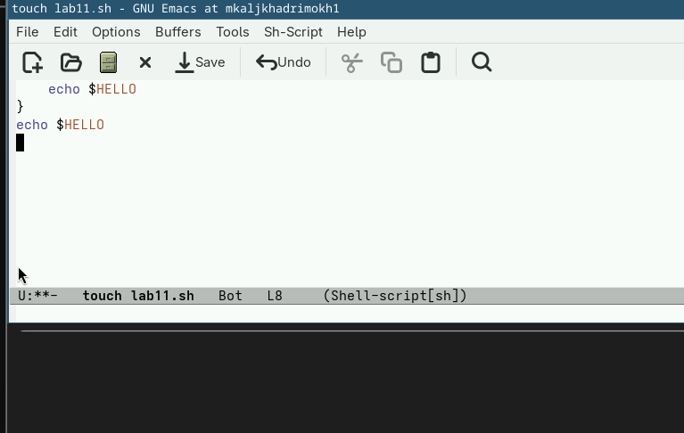

---

7.4 Переключение буферов (C-x b)  

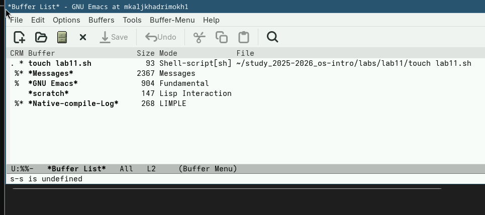

---

## Задание 5. Управление окнами

8.1 Разделение окна  

C-x 3 (вертикально)  
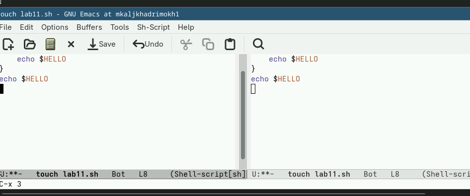
C-x 2 (горизонтально)  

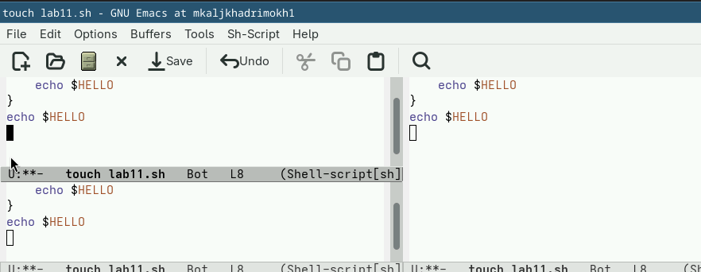

---

8.2 Работа в 4 окнах  

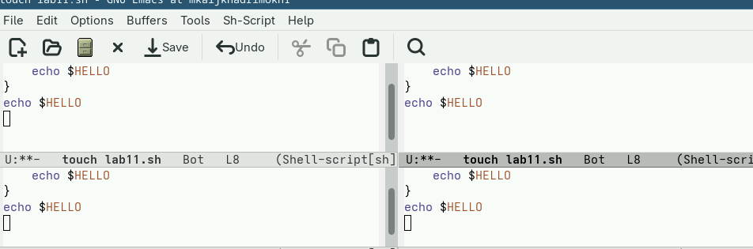

---

## Задание 6. Поиск и замена

9.1 Поиск (C-s)  

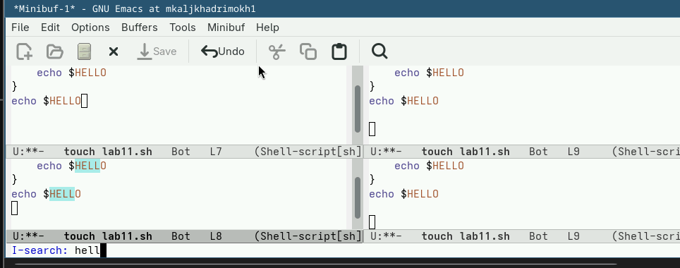

---

9.2 Переход по результатам  

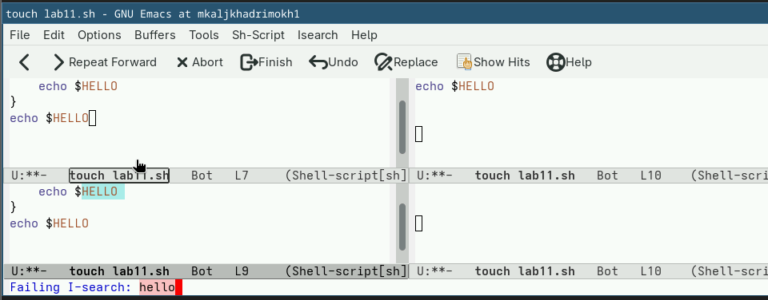

---

9.3 Выход (C-g)  

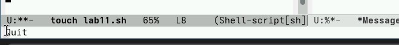

---

9.4 Поиск и замена (M-%)  

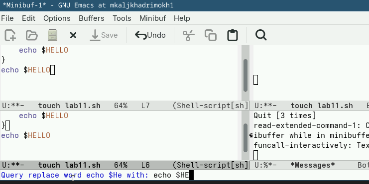

---

9.5 Альтернативный поиск (M-s o)  

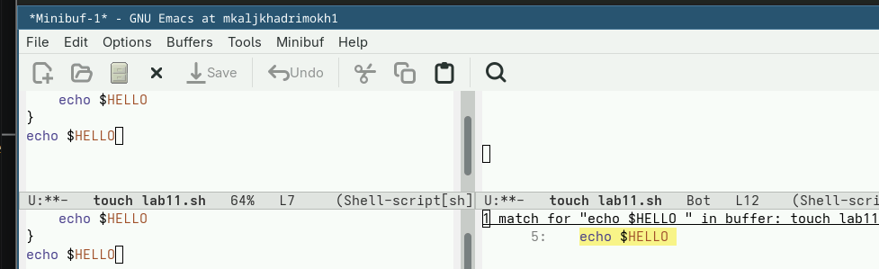

---

## Выводы
В ходе выполнения лабораторной работы были получены практические навыки работы с редактором Emacs. Освоены основные команды редактирования текста, перемещения курсора, работы с буферами и окнами, а также выполнения поиска и замены.

---

## Список литературы {.unnumbered}
1. Документация GNU Emacs  
2. Учебные материалы по курсу "Архитектура компьютера и операционные системы"  

---

## Контрольные вопросы

### 1. Что такое Emacs?
Emacs — это многофункциональный текстовый редактор с расширяемой архитектурой.

---

### 2. Как создать файл в Emacs?
Ctrl + x, Ctrl + f

---

### 3. Как сохранить файл?
Ctrl + x, Ctrl + s

---

### 4. Как выйти из Emacs?
Ctrl + x, Ctrl + c

---

### 5. Как вырезать строку?
Ctrl + k

---

### 6. Как вставить текст?
Ctrl + y

---

### 7. Как отменить действие?
Ctrl + /

---

### 8. Как перемещаться по тексту?
Ctrl + f, Ctrl + b, Ctrl + n, Ctrl + p

---

### 9. Как выполнить поиск?
Ctrl + s

---

### 10. Как выполнить замену текста?
Alt + %

---

### 11. Что такое буфер в Emacs?
Буфер — это область памяти, в которой открыт файл или данные.

---

### 12. Как переключаться между буферами?
Ctrl + x, b

---

### 13. В чем отличие Emacs от vi?
Emacs использует комбинации клавиш, а vi основан на режимах работы.