---
## Author
author:
name: Аль-хадри Мохаммед Фуад Мохаммед Хамуд
email: 1132255653@rudn.ru
affiliation:
- name: Российский университет дружбы народов
country: Российская Федерация
city: Москва
address: ул. Миклухо-Маклая, 21

## Title
title: "Лабораторная работа №12, Программирование в командном процессоре ОС UNIX. Командные файлы"
subtitle: "Архитектура компьютера и операционные системы"
name: Аль-хадри Мохаммед Фуад Мохаммед Хамуд
email: 1132255653@rudn.ru
-name: Российский университет дружбы народов
license: "CC BY"
---
\newpage

# Цель работы

Изучить основы программирования в оболочке ОС UNIX/Linux. Получить практические навыки написания командных файлов Bash, передачи параметров командной строки, работы с файлами и каталогами, а также использования управляющих конструкций языка Bash.

---

\newpage

# Задание

Выполнить задания раздела **10.3 «Последовательность выполнения работы»**: 

1. Написать скрипт, который при запуске делает резервную копию самого себя в каталог `backup` домашнего каталога пользователя и архивирует файл одним из архиваторов (`zip`, `bzip2` или `tar`).

2. Написать пример командного файла, обрабатывающего произвольное число аргументов командной строки, в том числе превышающее десять.

3. Написать командный файл — аналог команды `ls` (без использования команд `ls` и `dir`), выводящий информацию о каталоге и о возможностях доступа к файлам.

4. Написать командный файл, который получает в качестве аргумента формат файла (`.txt`, `.doc`, `.jpg`, `.pdf` и т.д.) и вычисляет количество таких файлов в указанной директории.

---

\newpage

# Теоретическое введение

Командная оболочка **Bash** представляет собой интерпретатор команд, позволяющий выполнять команды операционной системы, использовать переменные, циклы, условия и писать командные файлы.

В ходе лабораторной работы используются следующие возможности Bash:

* позиционные параметры (`$1`, `$2`, `$#`);
* команда `shift`;
* цикл `for`;
* команда `test`;
* метасимвол `*`;
* работа с файлами и каталогами.

В методических указаниях указано, что:

> `echo *` выводит имена всех файлов текущего каталога и представляет собой простейший аналог команды `ls`. 

Также в работе используются проверки:

* `test -d` — каталог;
* `test -f` — обычный файл;
* `test -r` — доступен по чтению;
* `test -w` — доступен по записи. 

---

\newpage

# Выполнение лабораторной работы

## Подготовка среды 

### 1. Открытие терминала

В среде **GitHub Codespaces** открыть встроенный терминал.

### 2. Проверка текущего каталога

```bash
pwd
```

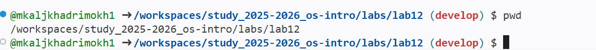{#текущего_каталога}

### 3. Создание файла скрипта

```bash
touch backup.sh
```

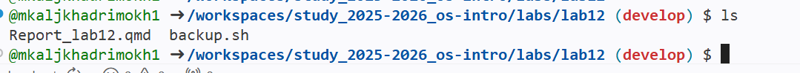{#Создание}

### 4. Открытие файла

Открыть созданный файл в редакторе и вставить исходный код.

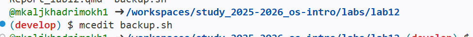{#Открытие}

### 5. Назначение права выполнения

```bash
chmod +x backup.sh
```

{#права}

### 6. Запуск скрипта

```bash
./backup.sh
```

{#Запуск}

---

\newpage

# Задание 1. Резервная копия самого себя

## Исходный код

```bash
#!/bin/bash

mkdir -p "$HOME/backup"

name=$(basename "$0")

tar -czf "$HOME/backup/${name}.tar.gz" "$0"
```

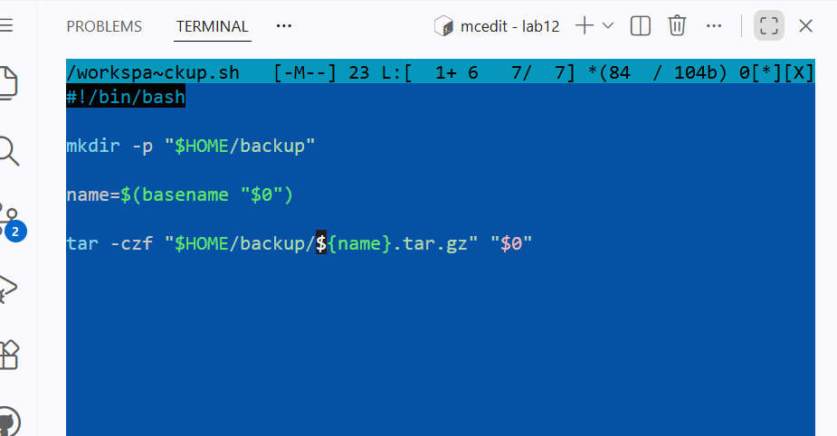{#Задание_1}

## Пояснение

Скрипт:

* создаёт каталог `backup` в домашнем каталоге;
* получает собственное имя через `$0`;
* архивирует самого себя в формате `tar.gz`.

## Запуск

```bash
chmod +x backup.sh
./backup.sh
```

{#Задание_1}

## Проверка результата

```bash
cd ~/backup
echo *
```

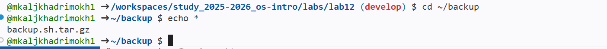{#Задание_1}

---

\newpage

# Задание 2. Обработка произвольного числа аргументов

## Исходный код

```bash
#!/bin/bash

while [ $# -gt 0 ]
do
    echo "$1"
    shift
done
```

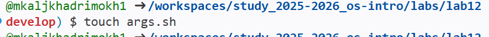{#Задание_2}
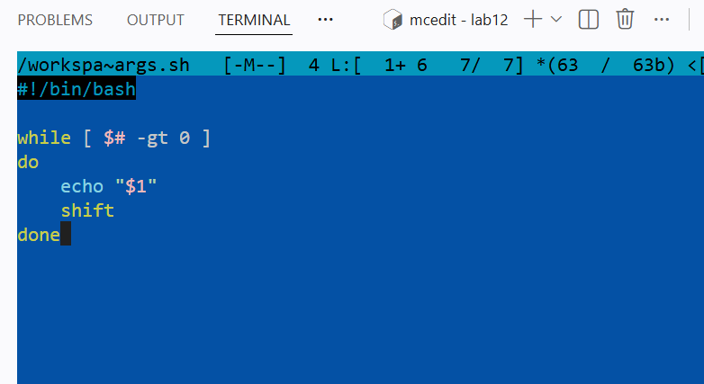{#Задание_2}

## Пояснение

Используются:

* `$#` — количество аргументов;
* `$1` — первый аргумент;
* `shift` — сдвиг аргументов. 

## Пример запуска

```bash
chmod +x args.sh
./args.sh one two three four five six seven eight nine ten eleven
```

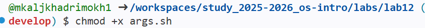{#Задание_2}
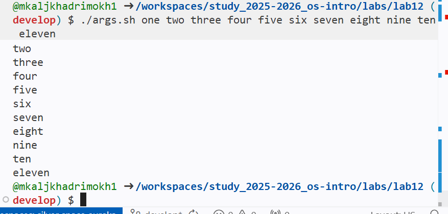{#Задание_2}

---

\newpage

# Задание 3. Аналог команды ls

## Исходный код

```bash
#!/bin/bash

cd "$1" || exit 1

for f in *
do
    echo -n "$f : "

    if test -d "$f"
    then
        echo -n "directory "
    else
        echo -n "file "
    fi

    if test -r "$f"
    then
        echo -n "readable "
    fi

    if test -w "$f"
    then
        echo -n "writable "
    fi

    echo
done
```

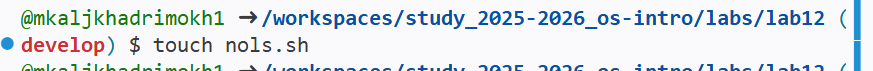{#Задание_3}
{#Задание_3}
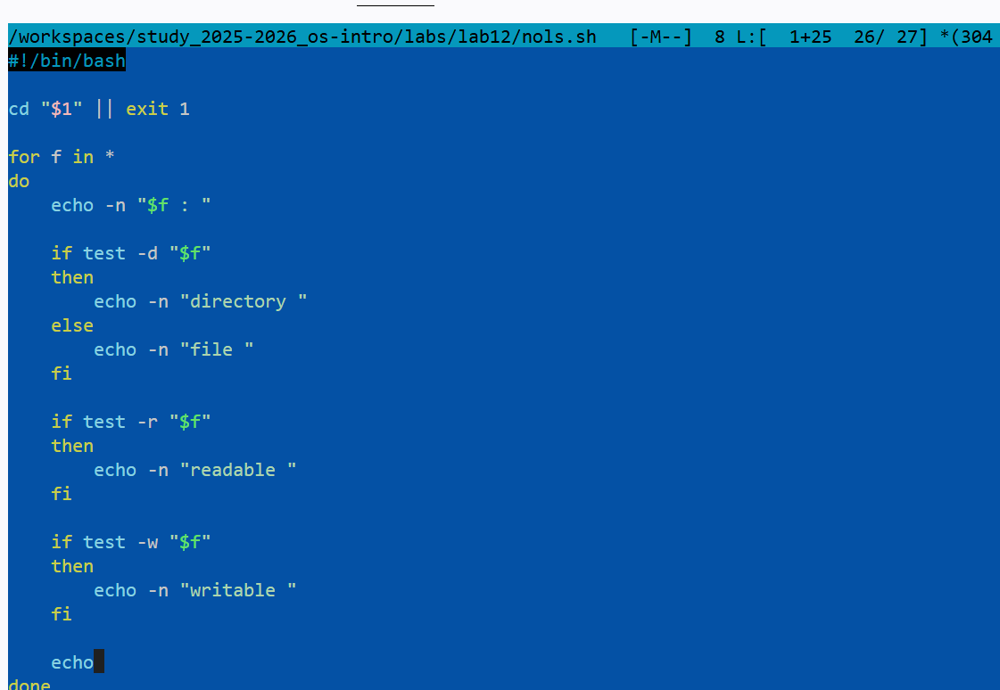{#Задание_3}

## Пояснение

Используется:

* `for f in *` — перебор всех файлов каталога;
* `test -d`, `test -r`, `test -w` — определение типа файла и прав доступа. 

## Пример запуска

```bash
chmod +x nols.sh
./nols.sh .
```

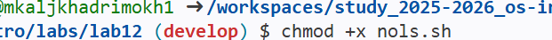{#Задание_3}

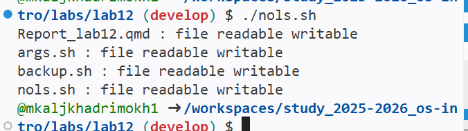{#Задание_3}

---

\newpage

# Задание 4. Подсчёт файлов по расширению

## Исходный код

```bash
#!/bin/bash

ext="$1"
dir="$2"

count=0

cd "$dir" || exit 1

for f in *"$ext"
do
    if test -f "$f"
    then
        count=$((count + 1))
    fi
done

echo "$count"
```

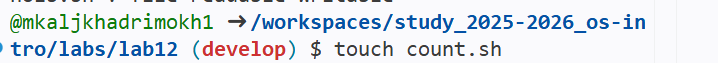{#Задание_4}
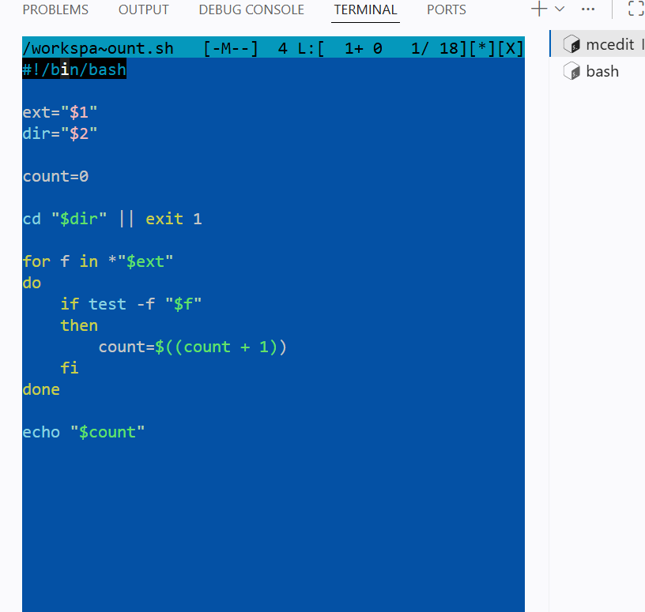{#Задание_4}

## Пример запуска

```bash
chmod +x count.sh
./count.sh .txt .
```

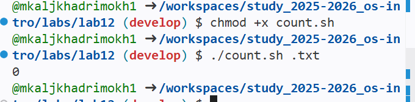{#Задание_4}

---

\newpage

# Выводы

В ходе выполнения лабораторной работы были изучены основные средства программирования в командной оболочке Bash.

Получены практические навыки:

* создания и запуска командных файлов;
* передачи аргументов командной строки;
* использования циклов и условий;
* работы с файлами и каталогами;
* проверки прав доступа к файлам.

---

\newpage

# Контрольные вопросы

## 1. Объясните понятие командной оболочки. Приведите примеры командных оболочек. Чем они отличаются?

Командная оболочка — это программа, обеспечивающая взаимодействие пользователя с операционной системой посредством ввода команд.

Примеры: `sh`, `csh`, `ksh`, `bash`.

Они отличаются синтаксисом, набором встроенных команд и возможностями программирования. 

---

## 2. Что такое POSIX?

POSIX — это набор стандартов, обеспечивающих совместимость UNIX/Linux-подобных операционных систем и переносимость программ. 

---

## 3. Как определяются переменные и массивы в языке программирования bash?

```bash
name=value
```

---

## 4. Каково назначение операторов let и read?

`let` выполняет арифметические вычисления.

`read` считывает значения со стандартного ввода. 

---

## 5. Какие арифметические операции можно применять в языке программирования bash?

Сложение, вычитание, умножение, деление, остаток от деления, логические и побитовые операции. 

---

## 6. Что означает операция (( ))?

Это форма записи арифметических выражений и условий в Bash. 

---

## 7. Какие стандартные имена переменных Вам известны?

`PATH`, `HOME`, `IFS`, `MAIL`, `TERM`, `LOGNAME`, `PS1`, `PS2`. 

---

## 8. Что такое метасимволы?

Метасимволы — специальные символы оболочки, имеющие служебный смысл.

Примеры: `*`, `?`, `[ ]`, `|`, `<`, `>`. 

---

## 9. Как экранировать метасимволы?

С помощью обратной косой черты `\`, одинарных или двойных кавычек. 

---

## 10. Как создавать и запускать командные файлы?

```bash
chmod +x file.sh
./file.sh
```

---

## 11. Как определяются функции в языке программирования bash?

```bash
function name() { }
```

---

## 12. Каким образом можно выяснить, является файл каталогом или обычным файлом?

```bash
test -d
test -f
```

---

## 13. Каково назначение команд set, typeset и unset?

* `set` — установка параметров и массивов;
* `typeset` — объявление типа переменной;
* `unset` — удаление переменной или функции. 

---

## 14. Как передаются параметры в командные файлы?

Через `$1`, `$2`, `$#`. 

---

## 15. Назовите специальные переменные языка bash и их назначение

* `$0` — имя скрипта;
* `$1 ... $9` — параметры;
* `$#` — количество аргументов;
* `$*` — все аргументы;
* `$?` — код завершения;
* `$$` — PID процесса;
```