---
## Author
author:
  name: Аль-хадри Мохаммед Фуад Мохаммед Хамуд
  email: 1132255653@rudn.ru
  affiliation:
    - name: Российский университет дружбы народов
      country: Российская Федерация
      city: Москва
      address: ул. Миклухо-Маклая
## Title
title:  Программирование в командном процессоре ОС UNIX. Ветвления и циклы
subtitle: Презентация по лабораторной работе №13
license: CC BY
date: today
date-format: "YYYY-MM-DD"
---

# Информация

## Докладчик

:::::::::::::: {.columns align=center}
::: {.column width="70%"}

  * Аль-хадри Мохаммед Фуад Мохаммед Хамуд
  * студент, НКАбд-01-25, 1132255653
  * факультет физико-математических и естественных наук
  * Российский университет дружбы народов им. П. Лумумбы

:::
::: {.column width="30%"}

:::
::::::::::::::

# 11.1. Цель работы

Изучить основы программирования в оболочке ОС UNIX. Научиться писать командные файлы с использованием логических управляющих конструкций, циклов, обработки аргументов командной строки, проверки кодов завершения программ, а также работы с файлами и архивами.

---

# 11.2. Ход выполнения работы

## Подготовка рабочей директории

Сначала была создана рабочая директория для выполнения лабораторной работы.

**Рисунок 1: Создание рабочей директории**  
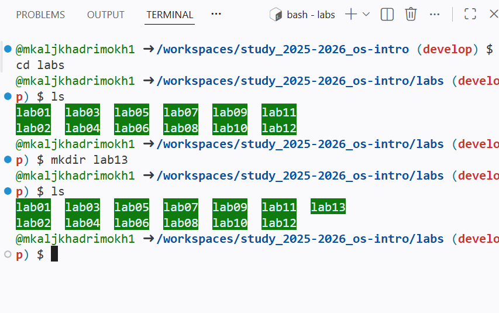

---

# Задание 1  
## Поиск строк в файле с использованием `getopts` и `grep`

### Условие

Необходимо написать командный файл, который обрабатывает ключи командной строки:

- `-i inputfile` — читать данные из указанного файла;
- `-o outputfile` — выводить результат в указанный файл;
- `-p pattern` — шаблон поиска;
- `-C` — учитывать регистр символов;
- `-n` — выводить номера строк.

После анализа параметров программа должна выполнить поиск нужных строк в указанном файле.

---

## Создание тестового файла

Был создан файл `data.txt` с тестовыми данными.

**Рисунок 2: Создание тестового файла**  
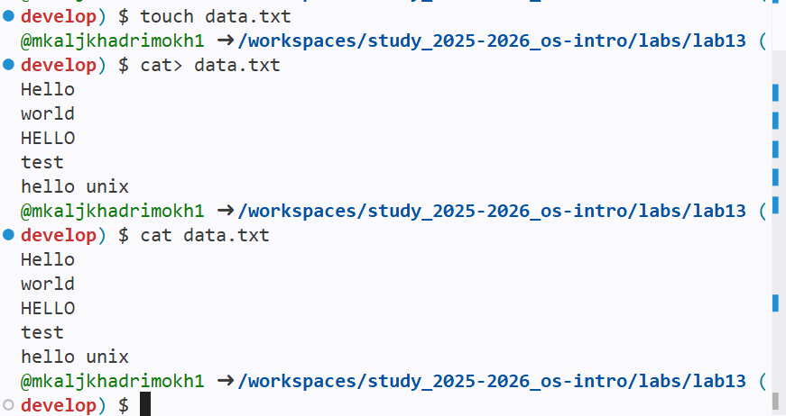

---

## Создание командного файла

Был создан командный файл `search.sh`, реализующий обработку параметров и поиск строк в указанном файле.

**Рисуно_3: Создание тестового файла**  
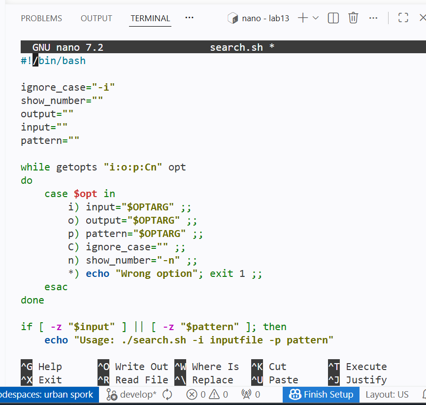

**Рисуно_add: Файл был сохранён и сделан исполняемыма**  
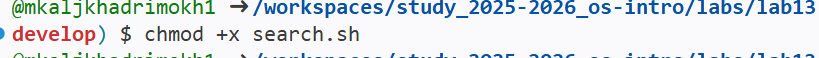

---

## Проверка работы программы

Была выполнена проверка работы программы:

- поиск строки;
- поиск с выводом номеров строк;
- поиск с учётом регистра;
- запись результата в выходной файл.

**Рисунок 3.1: Проверка работы поиска**  
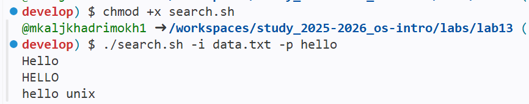
**Рисунок 3.2: Проверка работы поиска**  
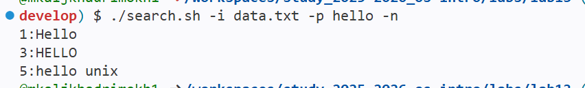
**Рисунок 3.3: Проверка работы поиска**  
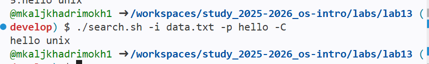
**Рисунок 3.4: Проверка работы поиска**  
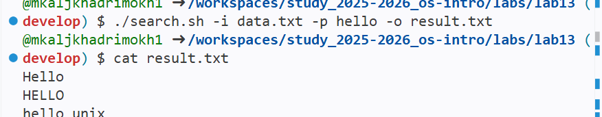

---

# Задание 2  
## Программа на языке C и анализ кода завершения

### Условие

Необходимо написать программу на языке C, которая:

- вводит число;
- определяет, является ли оно положительным, отрицательным или равным нулю;
- завершает работу с помощью `exit(n)`.

Командный файл должен запускать программу и анализировать код завершения через `$?`.

---

## Создание программы на языке C

Была создана программа `number.c`, определяющая знак введённого числа и возвращающая код завершения.

**Рисунок_add: Создание **  

**Рисунок_add: скрипт **  
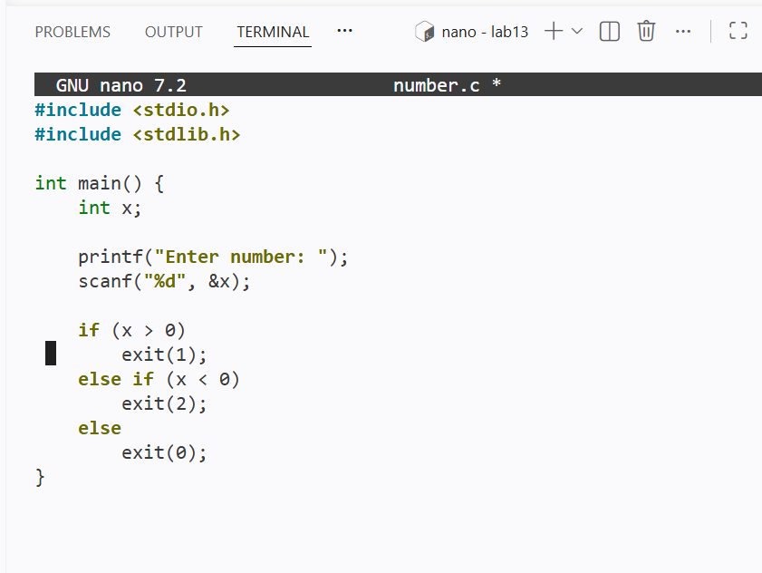

---

## Компиляция и проверка программы

Программа была скомпилирована и протестирована для различных значений:

- положительное число;
- отрицательное число;
- ноль.

**Рисунок 4: Компиляция и проверка программы на C**  
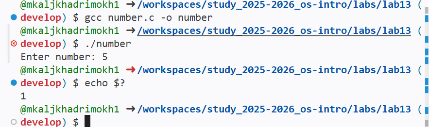

---

## Создание командного файла анализа результата

Был создан командный файл `check.sh`, который запускает программу и по значению `$?` выводит результат.

**Рисунок_add: Создание командного файла **  
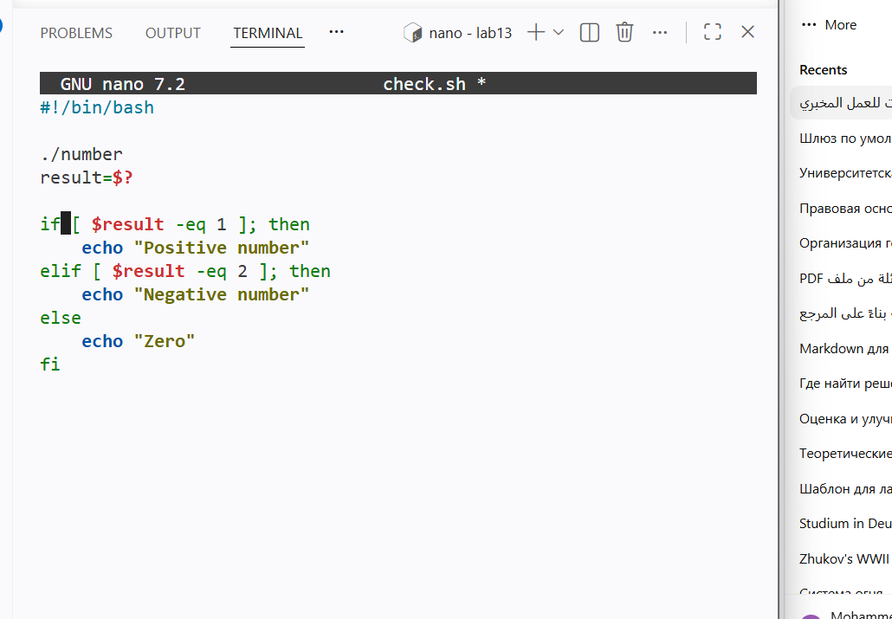
**Рисунок_add1: сохранение и chmod **  

---

## Проверка работы

Была выполнена проверка работы командного файла.

**Рисунок 5: Проверка анализа кода завершения**  
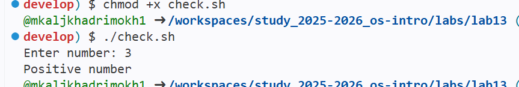 

---

# Задание 3  
## Создание и удаление файлов

### Условие

Необходимо написать командный файл, который:

- создаёт указанное количество файлов `1.tmp`, `2.tmp`, … `N.tmp`;
- удаляет созданные файлы.

---

## Создание командного файла

Был создан файл `files.sh`, реализующий создание и удаление файлов.

**Рисунок_add1: скрипт **  
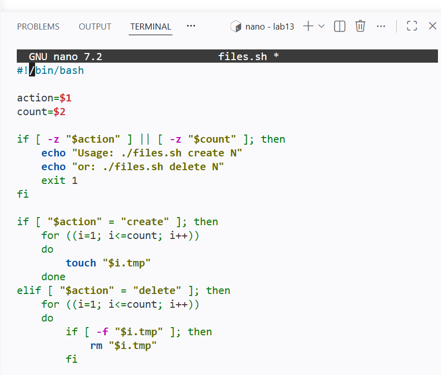

---

## Создание файлов

Было выполнено создание файлов.

**Рисунок 6: Создание временных файлов**  
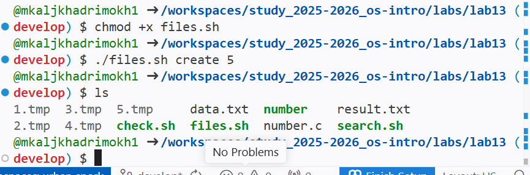

---

## Удаление файлов

Было выполнено удаление ранее созданных файлов.

**Рисунок 7: Удаление временных файлов**  
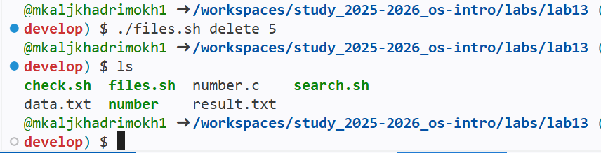

---

# Задание 4  
## Архивирование файлов с помощью `tar` и `find`

### Условие

Необходимо написать командный файл, который:

- архивирует все файлы указанной директории;
- архивирует только файлы, изменённые менее недели назад.

---

## Создание тестовой директории

Была создана тестовая директория с несколькими файлами.

**Рисунок 8: Создание тестовой директории**  
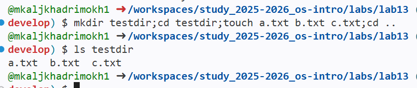

---

## Создание командного файла архивирования

Был создан файл `archive.sh`, выполняющий поиск файлов и создание архива.

**Рисунок 8: создание файла**  
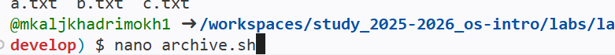

**Рисунок 8: скрипт**  
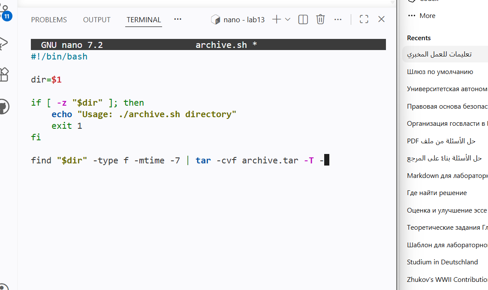

---

## Выполнение архивирования

Была выполнена команда архивирования файлов.

**Рисунок 9: Выполнение архивирования**  
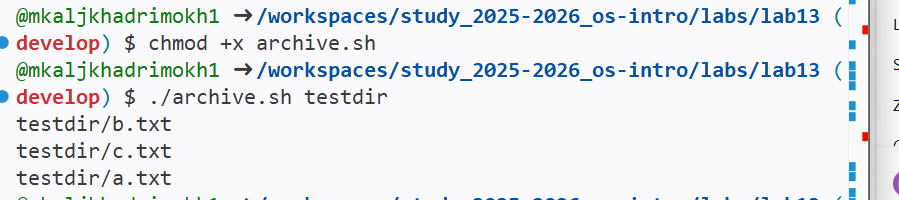

---

## Проверка содержимого архива

Было проверено содержимое созданного архива.

**Рисунок 10: Проверка содержимого архива**  
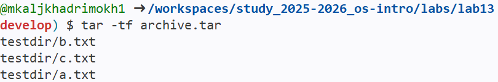

---

# Проверка содержимого рабочей директории

После выполнения всех заданий было проверено содержимое рабочей директории.

**Рисунок 11: Итоговое содержимое рабочей директории**  
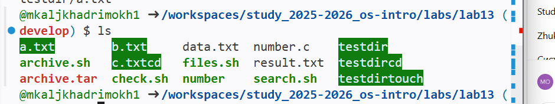

---

# 11.3. Выводы

В ходе выполнения лабораторной работы были изучены основы программирования в командной оболочке UNIX. Были освоены:

- обработка параметров командной строки с помощью `getopts`;
- использование условных операторов `if` и `case`;
- применение циклов `for`;
- анализ кода завершения программы через `$?`;
- создание и удаление файлов;
- архивирование файлов с использованием `tar` и `find`.

Поставленная цель лабораторной работы была достигнута.

---
