---
## Author
author:
  name: Аль-хадри Мохаммед Фуад Мохаммед Хамуд
  email: 1132255653@rudn.ru
  affiliation:
    - name: Российский университет дружбы народов
      country: Российская Федерация
      city: Москва
      address: ул. Миклухо-Маклая
## Title
title:  Научиться писать более сложные командные файлы с использованием логических управляющих конструкций и циклов.
subtitle: Презентация по лабораторной работе №14
license: CC BY
date: today
date-format: "YYYY-MM-DD"
---

# Информация

## Докладчик

:::::::::::::: {.columns align=center}
::: {.column width="70%"}

  * Аль-хадри Мохаммед Фуад Мохаммед Хамуд
  * студент, НКАбд-01-25, 1132255653
  * факультет физико-математических и естественных наук
  * Российский университет дружбы народов им. П. Лумумбы

:::
::: {.column width="30%"}

:::
::::::::::::::

 12.1. Цель работы

Изучить основы программирования в оболочке ОС UNIX. Научиться писать более сложные командные файлы с использованием логических управляющих конструкций и циклов.

---

# 12.2. Ход выполнения работы

## Подготовка рабочей директории

Сначала была создана рабочая директория для выполнения лабораторной работы.

**Рисунок 1: Создание рабочей директории**  
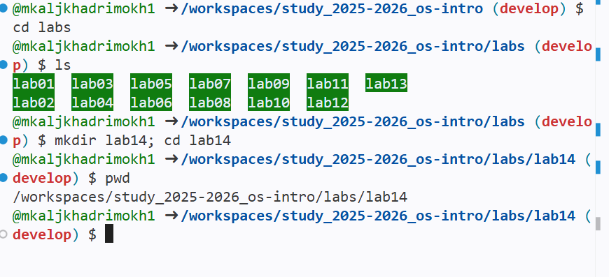

---

# Задание 1  
## Реализация упрощённого механизма семафоров

### Условие

Необходимо написать командный файл, который:

- ожидает освобождения ресурса;
- сообщает о занятости ресурса;
- использует ресурс некоторое время;
- поддерживает взаимодействие нескольких процессов.

---

## Создание командного файла

Был создан файл `semaphore.sh`, реализующий механизм семафора с использованием файла блокировки.

**Рисунок 2: Создание файла semaphore.sh**  

**Рисунок 2.1: Содержимое скрипта semaphore.sh**  
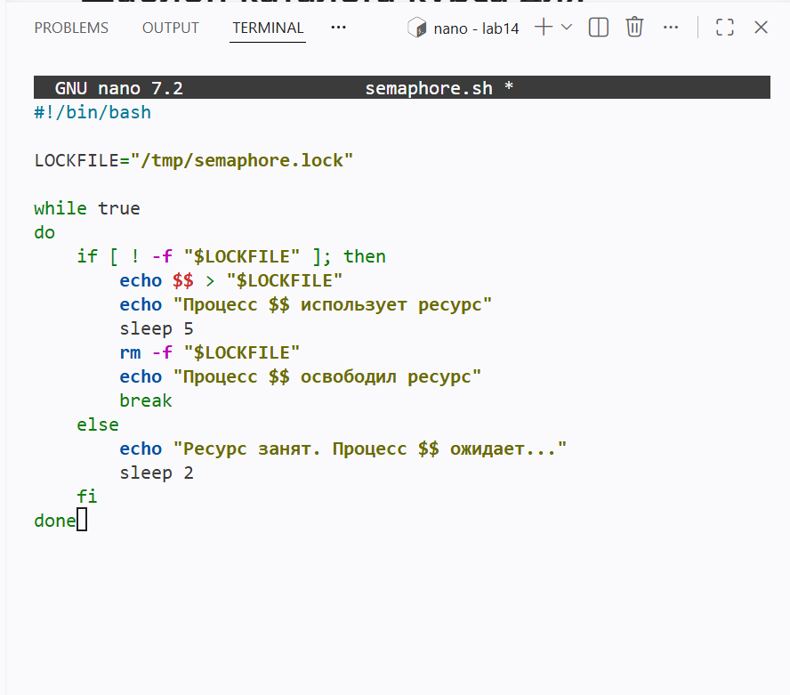

---

## Назначение прав на выполнение

Файл был сохранён и сделан исполняемым.

**Рисунок 3: Назначение прав на выполнение**  
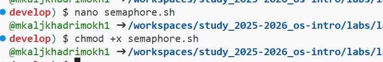

---

## Проверка работы программы

Скрипт был запущен в нескольких терминалах для проверки взаимодействия процессов.

**Рисунок 4: Запуск первого процесса**  
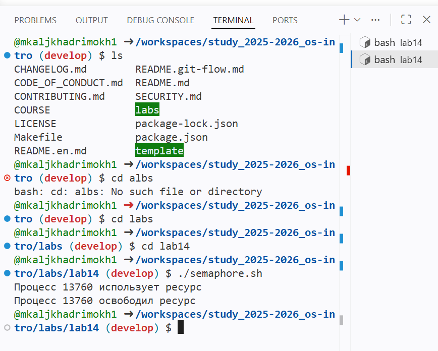

**Рисунок 5: Запуск второго процесса**  
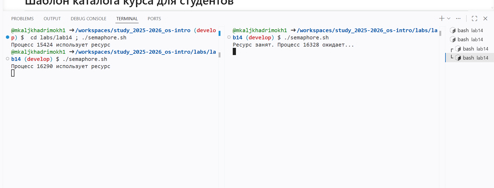

---

# Задание 2  
## Реализация команды man

### Условие

Необходимо реализовать командный файл, который:

- принимает имя команды;
- ищет соответствующую справку в каталоге `/usr/share/man/man1`;
- выводит справку или сообщение об ошибке.

---

## Создание командного файла

Был создан файл `myman.sh`, реализующий упрощённую команду `man`.

**Рисунок 7: Создание файла myman.sh**  
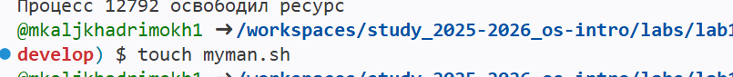

**Рисунок 8: Содержимое скрипта myman.sh**  
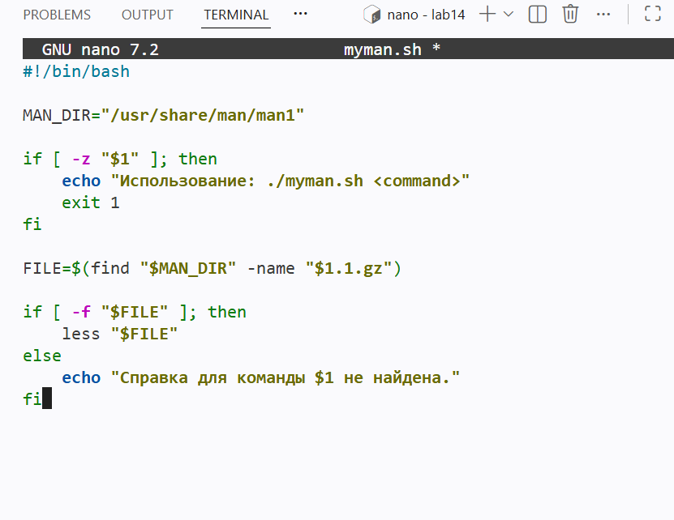

---

## Назначение прав и запуск программы

Файл был сделан исполняемым и протестирован.

**Рисунок 9: chmod и запуск программы**  
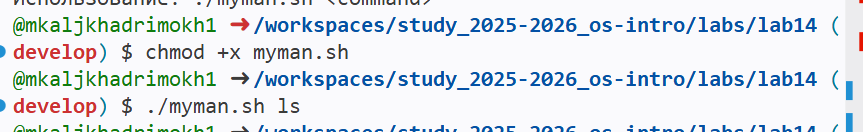

---

## Проверка работы

Была выполнена проверка поиска справки по различным командам.

**Рисунок 10: Просмотр справки ls**  
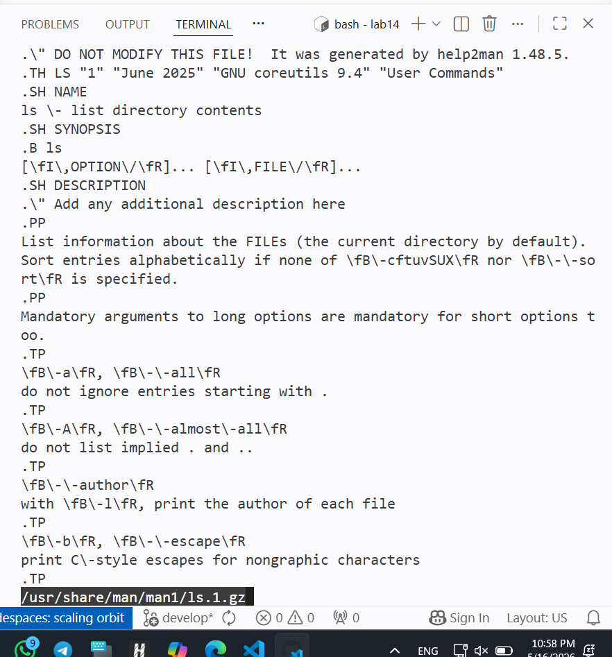

**Рисунок 11: Сообщение об отсутствии справки**  
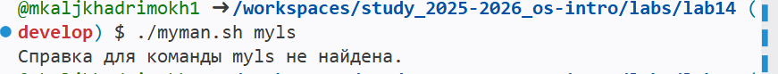

---

# Задание 3  
## Генерация случайной последовательности символов

### Условие

Необходимо написать командный файл, который:

- использует переменную `$RANDOM`;
- генерирует случайную последовательность латинских букв.

---

## Создание командного файла

Был создан файл `random_letters.sh`.

**Рисунок 12: Создание файла random_letters.sh**  

**Рисунок 13: Содержимое скрипта random_letters.sh**  
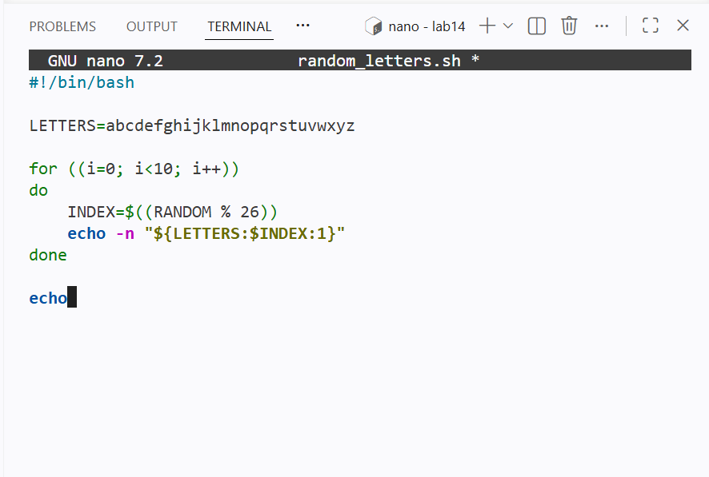

---

## Назначение прав на выполнение

Файл был сохранён и сделан исполняемым.

**Рисунок 14: chmod random_letters.sh**  

---

## Проверка работы программы

Была выполнена генерация случайных последовательностей символов.

**Рисунок 15: Результат выполнения программы**  
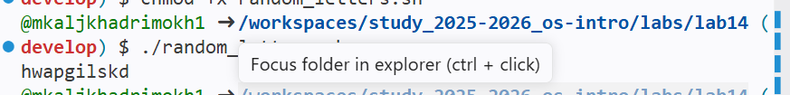

---

# Проверка содержимого рабочей директории

После выполнения всех заданий было проверено содержимое рабочей директории.

**Рисунок 16: Итоговое содержимое рабочей директории**  
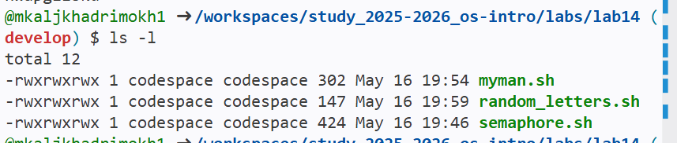

---

# 12.3. Выводы

В ходе выполнения лабораторной работы были изучены основы расширенного программирования в командной оболочке UNIX.

Были освоены:

- использование логических конструкций;
- применение циклов;
- организация взаимодействия процессов;
- работа с файлами блокировки;
- создание пользовательской реализации команды `man`;
- использование переменной `$RANDOM` для генерации случайных данных.

Поставленная цель лабораторной работы была достигнута.

---
